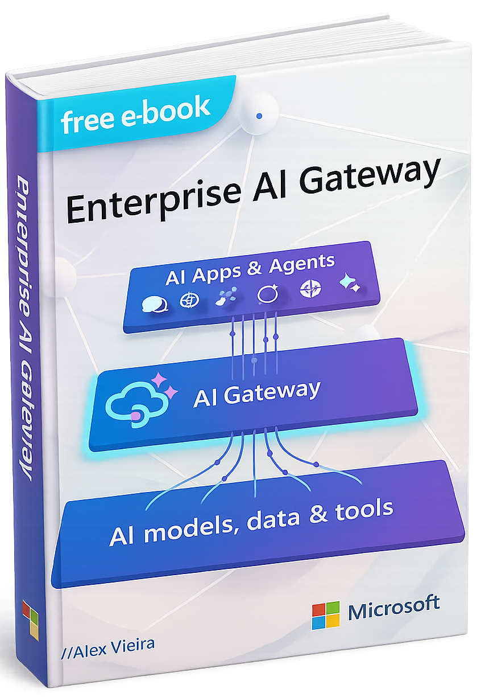

<!-- markdownlint-disable MD033 -->

<div align="center">

# ✨ AI Gateway Labs
[](https://github.com/Azure-Samples/AI-Gateway)
[](https://github.com/Azure-Samples/AI-Gateway/stargazers)
[](https://codespaces.new/Azure-Samples/AI-Gateway)


[](http://aka.ms/ai-gateway/labs)

### Explore the enterprise-grade gateway for managing AI Models, Tools, and Agents

<br/>

[](http://aka.ms/ai-gateway/labs)

[](https://learn.microsoft.com/azure/api-management/genai-gateway-capabilities)

</div>

## Why AI Gateway?

Building production-ready AI applications requires more than just calling model APIs. You need **security**, **reliability**, **observability**, and **cost control**—without slowing down innovation.

[**AI Gateway**](https://learn.microsoft.com/azure/api-management/genai-gateway-capabilities) powered by [Azure API Management](https://learn.microsoft.com/en-us/azure/api-management/) provides:

- 🔐 **Security** — OAuth 2.0, managed identities, content safety filtering
- ⚡ **Performance** — Load balancing, semantic caching, request routing
- 📊 **Observability** — Token metrics, built-in logging, tracing
- 💰 **Cost Control** — Rate limiting, quota management, FinOps framework
- 🔌 **Extensibility** — MCP protocol support, function calling, multi-model routing

## 📚 Explore the Labs

> **🔗 Browse all 30+ labs at [aka.ms/ai-gateway/labs](http://aka.ms/ai-gateway/labs)**

Each lab is a hands-on Jupyter notebook with step-by-step instructions, Bicep infrastructure templates, and APIM policies you can deploy to your Azure subscription.

## 🧠 AI Gateway for Models

Manage and control access to Large Language Models with enterprise-grade policies.

| Lab | Description |
|-----|-------------|
| [**Backend Pool Load Balancing**](labs/backend-pool-load-balancing/backend-pool-load-balancing.ipynb) | Distribute requests across multiple model endpoints |
| [**Token Rate Limiting**](labs/token-rate-limiting/token-rate-limiting.ipynb) | Control token consumption with rate limiting policies |
| [**Semantic Caching**](labs/semantic-caching/semantic-caching.ipynb) | Cache responses using vector similarity for faster, cheaper completions |
| [**Model Routing**](labs/model-routing/model-routing.ipynb) | Route requests to different backends based on model and version |
| [**FinOps Framework**](labs/finops-framework/finops-framework.ipynb) | Manage AI budgets with automated quota controls |

## 🔧 AI Gateway for Tools

Enable secure tool access with MCP protocol and function calling capabilities.

| Lab | Description |
|-----|-------------|
| [**Model Context Protocol (MCP)**](labs/model-context-protocol/model-context-protocol.ipynb) | Plug & play tools with OAuth credential management |
| [**MCP Client Authorization**](labs/mcp-client-authorization/mcp-client-authorization.ipynb) | Implement MCP with the client authorization flow |
| [**Function Calling**](labs/function-calling/function-calling.ipynb) | Use OpenAI function calling with Azure Functions backend |
| [**Realtime Audio + MCP**](labs/realtime-mcp-agents/realtime-mcp-agents.ipynb) | Combine realtime voice API with MCP tools |

## 🤖 AI Gateway for Agents

Build and control agentic applications with orchestration frameworks.

| Lab | Description |
|-----|-------------|
| [**AI Agent Service**](labs/ai-agent-service/ai-agent-service.ipynb) | Explore Foundry Agent Service with multi-service control |
| [**OpenAI Agents SDK**](labs/openai-agents/openai-agents.ipynb) | Use OpenAI Agents with Azure OpenAI and APIM-managed tools |
| [**Gemini MCP Agents**](labs/gemini-mcp-agents/gemini-mcp-agents.ipynb) | Integrate Google Gemini models with MCP tools |
| [**A2A Enabled Agents**](labs/mcp-a2a-agents/mcp-agent-as-a2a-server.ipynb) | A2A-enabled Agents with models and MCP plug & play tools |

## 🚀 Quick Start

### Prerequisites

- [Python 3.12+](https://www.python.org/)
Python environment with the requirements.txt or run pip install -r requirements.txt in your terminal
- [Python environment](https://code.visualstudio.com/docs/python/environments#_creating-environments) with the [requirements.txt](../../requirements.txt) or run `pip install -r requirements.txt` in your terminal
- [VS Code](https://code.visualstudio.com/) with [Jupyter extension](https://marketplace.visualstudio.com/items?itemName=ms-toolsai.jupyter)
- [Azure Subscription](https://azure.microsoft.com/free/) with Contributor + RBAC Administrator roles
- [Azure CLI](https://learn.microsoft.com/cli/azure/install-azure-cli) authenticated to your subscription

### Get Started

```bash
# Clone the repository
git clone https://github.com/Azure-Samples/AI-Gateway.git
cd AI-Gateway

# Open VS Code and start with a lab
code .
```

Or launch instantly with **[GitHub Codespaces](https://codespaces.new/Azure-Samples/AI-Gateway/tree/main)** ☁️

## 🔨 Developer Tools

The [`tools/`](tools/) folder provides utilities for testing and development:

| Tool | Description |
|------|-------------|
| [**Tracing**](tools/tracing.ipynb) | Invoke AI Foundry APIs with tracing enabled |
| [**Streaming**](tools/streaming.ipynb) | Test streaming responses from AI models |
| [**Rate Limit Tester**](tools/rate-limit.ipynb) | Validate rate limiting configurations |
| [**Mock Server**](tools/mock-server/mock-server.ipynb) | OpenAI API mock for local development and testing |
| [**OAuth Client**](tools/client-oauth.ipynb) | Test OAuth authentication flows |

## 👩‍💻 Build Your Own Labs with AI

This repository includes **Copilot Agent Skills** that help you create new labs using AI-assisted development in VS Code.

### Available Skills

| Skill | Description |
|-------|-------------|
| `lab-creator` | Scaffolds new labs with notebooks, Bicep, and policies |
| `apim-bicep` | Generates Azure Bicep templates for APIM resources |
| `apim-terraform` | Generates Terraform configurations for APIM |
| `apim-policies` | Creates APIM XML policies for AI gateway scenarios |
| `apim-kql` | Generates queries in KQL to control models, tools and agents |
| `mcp-builder` | Builds MCP servers for tool integration |

### Example: Create a New Lab

Open this repo in VS Code with GitHub Copilot and use this prompt:

```
Create a new lab called "multi-model-failover" that demonstrates how to 
implement automatic failover between different AI models when the primary 
model is unavailable or throttled. Include:
- A backend pool with priority-based routing
- Retry policy with exponential backoff
- Circuit breaker pattern for unhealthy backends
- Built-in LLM logging to track usage across all backends
- Test the model with a LangChain agent: https://docs.langchain.com/oss/python/langchain/agents
Use gpt-4.1-mini as primary and gpt-4.1-nano as fallback, deploy to Sweden Central.
```

Copilot will generate the complete lab structure including:
- 📓 Jupyter notebook with step-by-step instructions
- 🦾 Bicep infrastructure template
- ⚙️ APIM policy XML
- 📖 README documentation
- 🧹 Cleanup notebook

## 🏛️ Well-Architected Framework

Labs are designed following [Azure Well-Architected Framework](https://learn.microsoft.com/azure/well-architected/what-is-well-architected-framework) principles:

| Pillar | Labs |
|--------|------|
| **Security** | Access controlling, Content safety, Private connectivity |
| **Reliability** | Backend pool load balancing, Token rate limiting |
| **Performance** | Semantic caching, Model routing |
| **Operations** | Built-in logging, Token metrics emitting |
| **Cost** | FinOps framework, Semantic caching |

## 📕 Enterprise AI Gateway e-Book

<table>
  <tr>
    <td><a href="docs/media/Enterprise%20AI%20Gateway%20eBook%20-%20Feb%202026.pdf"></a></td>
    <td>Download the <a href="docs/media/Enterprise%20AI%20Gateway%20eBook%20-%20Feb%202026.pdf">Enterprise AI Gateway e-Book</a> for comprehensive end-to-end view of the Enterprise AI Gateway pattern, explaining why a centralized governance layer is essential for organizations adopting AI at scale and how it can be practically implemented using Azure API Management and Microsoft Foundry.</td>
  </tr>
</table>

## 🎬 Conferences & Webcasts

Learn from experts through these videos covering AI Gateway concepts and implementations.

| | | | |
|:---:|:---:|:---:|:---:|
| [](https://www.youtube.com/watch?v=TG4ZULpS81w) | [](https://www.youtube.com/watch?v=yNkK6q1vFF8) | [](https://www.youtube.com/watch?v=ian7K6QKgJQ) | [](https://www.youtube.com/watch?v=ou3QEAcxW3o)
[](https://www.youtube.com/watch?v=HuPNgrjMcuI) | [](https://www.youtube.com/watch?v=gOopye0Hwo4) | [](https://www.youtube.com/watch?v=WCtcBL4GZXs)| [](https://www.youtube.com/watch?v=8Fzu8kF47Bw)
[](https://www.youtube.com/watch?v=2pW6Z2VwHmQ) | [](https://www.youtube.com/watch?v=dBTCgzTe900) | [](https://www.youtube.com/watch?v=yYt1-a7RocU) | [](https://www.youtube.com/watch?v=l_8dTUwrqNw)
[](https://www.youtube.com/watch?v=C17qTB3fL3Y) | [](https://www.youtube.com/watch?v=QRCHKN9PX7o) | | | |

## 📖 Resources

- 📘 [AI Gateway Documentation](https://learn.microsoft.com/azure/api-management/genai-gateway-capabilities)
- 🎓 [AI Gateway Workshop](https://aka.ms/ai-gateway/workshop)
- ⚙️ [APIM Samples](https://github.com/Azure-Samples/Apim-Samples)
- 📚 [APIM Learning Modules](https://learn.microsoft.com/training/browse/?products=azure-api-management)
- 💡 [Landing Zone Accelerator](https://learn.microsoft.com/azure/cloud-adoption-framework/scenarios/app-platform/api-management/landing-zone-accelerator)
- 🏛️ [Foundry Ctadel](https://aka.ms/foundry-citadel)
- 📰 [API Management News](https://techcommunity.microsoft.com/tag/API%20Management)

## 🤝 Contributing

Contributions are welcome! Please read [CONTRIBUTING.md](CONTRIBUTING.MD) for guidelines.

## ⚠️ Disclaimer

> This software is provided for demonstration purposes only. It is not intended to be relied upon for any purpose. The creators make no representations or warranties about the completeness, accuracy, reliability, or suitability of this software.


<div align="center">

[](http://aka.ms/apimlove)

</div>
