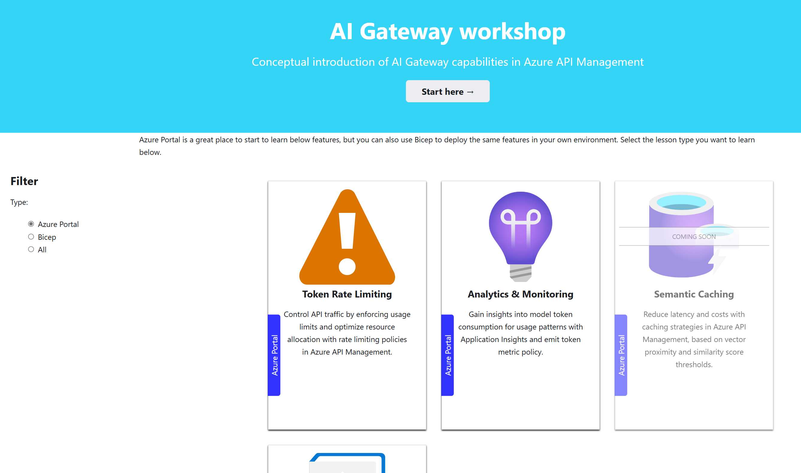
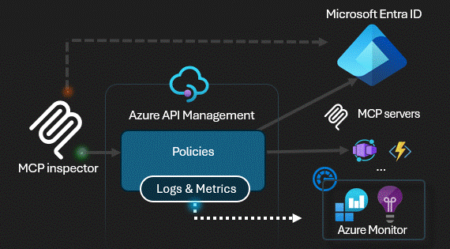
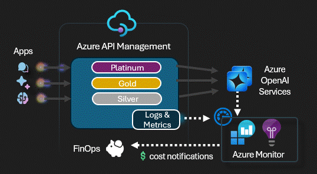
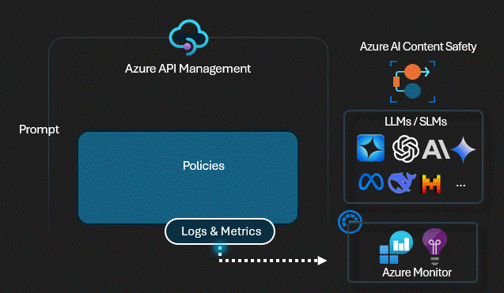

<!-- markdownlint-disable MD033 -->

# 🧪 [AI Gateway](https://learn.microsoft.com/en-us/azure/api-management/genai-gateway-capabilities) labs

_If you are interested in quickly setting up many API Management infrastructures and experiment with various scenarios, please check out the excellent [APIM Samples](https://aka.ms/apim/samples) GitHub repository._  
_For much more API Management content, please also check out [APIM Love](https://aka.ms/apimlove)._

## What's new ✨

➕ [**AI Gateway workshop**](https://aka.ms/ai-gateway/workshop) provides a comprehensive learning experience using the Azure Portal  

  

 
➕ Refactor most of the labs to use the new [**LLM built-in logging**](https://azure.microsoft.com/en-us/updates?id=491970) that supports streaming completions.  
➕ **Realtime API (Audio and Text) with Azure OpenAI 🔥** experiments with the [**AOAI Realtime**](labs/realtime-audio/realtime-audio.ipynb)  
➕ **Realtime API (Audio and Text) with Azure OpenAI + MCP tools 🔥** experiments with the [**AOAI Realtime + MCP**](labs/realtime-mcp-agents/realtime-mcp-agents.ipynb)  
➕ **Model Context Protocol (MCP) ⚙️** experiments with the [**client authorization flow**](labs/mcp-client-authorization/mcp-client-authorization.ipynb)  
➕ the [**FinOps Framework**](labs/finops-framework/finops-framework.ipynb) lab to manage AI budgets effectively 💰  
➕ **Agentic ✨** experiments with [**Model Context Protocol (MCP)**](labs/model-context-protocol/model-context-protocol.ipynb).  
➕ **Agentic ✨** experiments with [**OpenAI Agents SDK**](labs/openai-agents/openai-agents.ipynb).  
➕ **Agentic ✨** experiments with [**AI Agent Service**](labs/ai-agent-service/ai-agent-service.ipynb) from [Azure AI Foundry](https://azure.microsoft.com/en-us/products/ai-foundry).  

## Contents

1. [🧠 AI Gateway](#-ai-gateway)
1. [🧪 Labs with AI Agents](#-labs-with-ai-agents)
1. [🧪 Labs with the Inference API](#-labs-with-the-inference-api)
1. [🧪 Labs based on Azure OpenAI](#-labs-based-on-azure-openai)
1. [🚀 Getting started](#-getting-started)
1. [🔨 Supporting tools](#-supporting-tools)
1. [🏛️ Well-Architected Framework](#-well-architected-framework)    <!-- markdownlint-disable-line MD051 -->
1. [🥇 Other Resources](#-other-resources)

The rapid pace of AI advances demands experimentation-driven approaches for organizations to remain at the forefront of the industry. With AI steadily becoming a game-changer for an array of sectors, maintaining a fast-paced innovation trajectory is crucial for businesses aiming to leverage its full potential.

**AI services** are predominantly accessed via **APIs**, underscoring the essential need for a robust and efficient API management strategy. This strategy is instrumental for maintaining control and governance over the consumption of **AI models**, **data** and **tools**.

With the expanding horizons of **AI services** and their seamless integration with **APIs**, there is a considerable demand for a comprehensive **AI Gateway** pattern, which broadens the core principles of API management. Aiming to accelerate the experimentation of advanced use cases and pave the road for further innovation in this rapidly evolving field. The well-architected principles of the **AI Gateway** provides a framework for the confident deployment of **Intelligent Apps** into production.

## 🧠 AI Gateway

This repo explores the **AI Gateway** pattern through a series of experimental labs. The [AI Gateway capabilities](https://learn.microsoft.com/en-us/azure/api-management/genai-gateway-capabilities) of [Azure API Management](https://learn.microsoft.com/azure/api-management/api-management-key-concepts) plays a crucial role within these labs, handling AI services APIs, with security, reliability, performance, overall operational efficiency and cost controls. The primary focus is on [Azure AI Foundry models](https://learn.microsoft.com/en-us/azure/ai-foundry/what-is-azure-ai-foundry), which sets the standard reference for Large Language Models (LLM). However, the same principles and design patterns could potentially be applied to any third party model.

Acknowledging the rising dominance of Python, particularly in the realm of AI, along with the powerful experimental capabilities of Jupyter notebooks, the following labs are structured around Jupyter notebooks, with step-by-step instructions with Python scripts, [Bicep](https://learn.microsoft.com/azure/azure-resource-manager/bicep/overview?tabs=bicep) files and [Azure API Management policies](https://learn.microsoft.com/azure/api-management/api-management-howto-policies):

## 🧪 Labs with AI Agents

<!-- MCP Client Authorization -->
### [**🧪 MCP Client Authorization**](labs/mcp-client-authorization/mcp-client-authorization.ipynb)

Playground to experiment the [Model Context Protocol](https://modelcontextprotocol.io/) with the [client authorization flow](https://modelcontextprotocol.io/specification/2025-03-26/basic/authorization#2-10-third-party-authorization-flow). In this flow, Azure API Management act both as an OAuth client connecting to the [Microsoft Entra ID](https://learn.microsoft.com/en-us/entra/architecture/auth-oauth2) authorization server and as an OAuth authorization server for the MCP client ([MCP inspector](https://modelcontextprotocol.io/docs/tools/inspector) in this lab).

[🦾 Bicep](labs/mcp-client-authorization/main.bicep) ➕ [⚙️ Policy](labs/mcp-client-authorization/src/weather/apim-api/policy.xml) ➕ [🧾 Notebook](labs/mcp-client-authorization/mcp-client-authorization.ipynb)

<!-- Model Context Protocol (MCP) -->
### [**🧪 Model Context Protocol (MCP)**](labs/model-context-protocol/model-context-protocol.ipynb)

Playground to experiment the [Model Context Protocol](https://modelcontextprotocol.io/) with Azure API Management to enable plug & play of tools to LLMs. Leverages the [credential manager](https://learn.microsoft.com/en-us/azure/api-management/credentials-overview) for  managing OAuth 2.0 tokens to backend tools and [client token validation](https://learn.microsoft.com/en-us/azure/api-management/validate-jwt-policy) to ensure end-to-end authentication and authorization.  

[🦾 Bicep](labs/model-context-protocol/main.bicep) ➕ [⚙️ Policy](labs/model-context-protocol/inference-policy.xml) ➕ [🧾 Notebook](labs/model-context-protocol/model-context-protocol.ipynb)

<!-- OpenAI Agents -->
### [**🧪 OpenAI Agents**](labs/openai-agents/openai-agents.ipynb)

Playground to try the [OpenAI Agents](https://openai.github.io/openai-agents-python/) with Azure OpenAI models and API based tools controlled by Azure API Management.

[🦾 Bicep](labs/openai-agents/main.bicep) ➕ [⚙️ Policy](labs/openai-agents/inference-policy.xml) ➕ [🧾 Notebook](labs/openai-agents/openai-agents.ipynb)

<!-- AI Agent Service -->
### [**🧪 AI Agent Service**](labs/ai-agent-service/ai-agent-service.ipynb)

Use this playground to explore the [Azure AI Agent Service](https://learn.microsoft.com/en-us/azure/ai-services/agents/overview), leveraging Azure API Management to control multiple services, including Azure OpenAI models, Logic Apps Workflows, and OpenAPI-based APIs.

[🦾 Bicep](labs/ai-agent-service/main.bicep) ➕ [⚙️ Policy](labs/ai-agent-service/openai-policy.xml) ➕ [🧾 Notebook](labs/ai-agent-service/ai-agent-service.ipynb)

<!-- Function calling -->
### [**🧪 Function calling**](labs/function-calling/function-calling.ipynb)

Playground to try the OpenAI [function calling](https://learn.microsoft.com/azure/ai-services/openai/how-to/function-calling?tabs=non-streaming%2Cpython) feature with an Azure Functions API that is also managed by Azure API Management.

[🦾 Bicep](labs/function-calling/main.bicep) ➕ [⚙️ Policy](labs/function-calling/policy.xml) ➕ [🧾 Notebook](labs/function-calling/function-calling.ipynb)

## 🧪 Labs with the Inference API

<!-- AI Foundry Deepseek -->
### [**🧪 AI Foundry Deepseek**](labs/ai-foundry-deepseek/ai-foundry-deepseek.ipynb)

Playground to try the [Deepseek R1 model](https://azure.microsoft.com/en-us/blog/deepseek-r1-is-now-available-on-azure-ai-foundry-and-github/) via the AI Model Inference from [Azure AI Foundry](https://azure.microsoft.com/en-us/products/ai-foundry). This lab uses the [Azure AI Model Inference API](https://learn.microsoft.com/en-us/azure/ai-foundry/model-inference/how-to/inference?tabs=python) and two APIM LLM policies: [llm-token-limit](https://learn.microsoft.com/en-us/azure/api-management/llm-token-limit-policy) and [llm-emit-token-metric](https://learn.microsoft.com/en-us/azure/api-management/llm-emit-token-metric-policy).

[🦾 Bicep](labs/ai-foundry-deepseek/main.bicep) ➕ [⚙️ Policy](labs/ai-foundry-deepseek/policy.xml) ➕ [🧾 Notebook](labs/ai-foundry-deepseek/ai-foundry-deepseek.ipynb)

<!-- SLM self-hosting -->
### [**🧪 SLM self-hosting**](labs/slm-self-hosting/slm-self-hosting.ipynb) (Phi-3)

Playground to try the self-hosted [Phi-3 Small Language Model (SLM)](https://azure.microsoft.com/blog/introducing-phi-3-redefining-whats-possible-with-slms/) through the [Azure API Management self-hosted gateway](https://learn.microsoft.com/azure/api-management/self-hosted-gateway-overview) with OpenAI API compatibility.

[🦾 Bicep](labs/slm-self-hosting/main.bicep) ➕ [⚙️ Policy](labs/slm-self-hosting/policy.xml) ➕ [🧾 Notebook](labs/slm-self-hosting/slm-self-hosting.ipynb)

## 🧪 Labs based on Azure OpenAI

<!--FinOps framework -->
### [**🧪 FinOps Framework**](labs/finops-framework/finops-framework.ipynb)

This playground leverages the [FinOps Framework](https://www.finops.org/framework/) and Azure API Management to control AI costs. It uses the [token limit](https://learn.microsoft.com/en-us/azure/api-management/azure-openai-token-limit-policy) policy for each [product](https://learn.microsoft.com/en-us/azure/api-management/api-management-howto-add-products?tabs=azure-portal&pivots=interactive) and integrates [Azure Monitor alerts](https://learn.microsoft.com/en-us/azure/azure-monitor/alerts/alerts-overview) with [Logic Apps](https://learn.microsoft.com/en-us/azure/azure-monitor/alerts/alerts-logic-apps?tabs=send-email) to automatically disable APIM [subscriptions](https://learn.microsoft.com/en-us/azure/api-management/api-management-subscriptions) that exceed cost quotas.  

[🦾 Bicep](labs/finops-framework/main.bicep) ➕ [⚙️ Policy](labs/finops-framework/openai-policy.xml) ➕ [🧾 Notebook](labs/finops-framework/finops-framework.ipynb)

<!-- Backend pool load balancing -->
### [**🧪 Backend pool load balancing**](labs/backend-pool-load-balancing/backend-pool-load-balancing.ipynb) - Available with [Bicep](labs/backend-pool-load-balancing/backend-pool-load-balancing.ipynb) and [Terraform](labs/backend-pool-load-balancing-tf/backend-pool-load-balancing-tf.ipynb)

Playground to try the built-in load balancing [backend pool functionality of Azure API Management](https://learn.microsoft.com/azure/api-management/backends?tabs=bicep) to either a list of Azure OpenAI endpoints or mock servers.

[🦾 Bicep](labs/backend-pool-load-balancing/main.bicep) ➕ [⚙️ Policy](labs/backend-pool-load-balancing/policy.xml) ➕ [🧾 Notebook](labs/backend-pool-load-balancing/backend-pool-load-balancing.ipynb)

<!-- Token rate limiting -->
### [**🧪 Token rate limiting**](labs/token-rate-limiting/token-rate-limiting.ipynb)

Playground to try the [token rate limiting policy](https://learn.microsoft.com/azure/api-management/azure-openai-token-limit-policy) to one or more Azure OpenAI endpoints. When the token usage is exceeded, the caller receives a 429.

[🦾 Bicep](labs/token-rate-limiting/main.bicep) ➕ [⚙️ Policy](labs/token-rate-limiting/policy.xml) ➕ [🧾 Notebook](labs/token-rate-limiting/token-rate-limiting.ipynb)

<!-- Token metrics emitting -->
### [**🧪 Token metrics emitting**](labs/token-metrics-emitting/token-metrics-emitting.ipynb)

Playground to try the [emit token metric policy](https://learn.microsoft.com/azure/api-management/azure-openai-emit-token-metric-policy). The policy sends metrics to Application Insights about consumption of large language model tokens through Azure OpenAI Service APIs.

[🦾 Bicep](labs/token-metrics-emitting/main.bicep) ➕ [⚙️ Policy](labs/token-metrics-emitting/policy.xml) ➕ [🧾 Notebook](labs/token-metrics-emitting/token-metrics-emitting.ipynb)

<!-- Semantic caching -->
### [**🧪 Semantic caching**](labs/semantic-caching/semantic-caching.ipynb)

Playground to try the [semantic caching policy](https://learn.microsoft.com/azure/api-management/azure-openai-semantic-cache-lookup-policy). Uses vector proximity of the prompt to previous requests and a specified similarity score threshold.

[🦾 Bicep](labs/semantic-caching/main.bicep) ➕ [⚙️ Policy](labs/semantic-caching/policy.xml) ➕ [🧾 Notebook](labs/semantic-caching/semantic-caching.ipynb)

<!-- Access controlling -->
### [**🧪 Access controlling**](labs/access-controlling/access-controlling.ipynb)

Playground to try the [OAuth 2.0 authorization feature](https://learn.microsoft.com/azure/api-management/api-management-authenticate-authorize-azure-openai#oauth-20-authorization-using-identity-provider) using identity provider to enable more fine-grained access to OpenAPI APIs by particular users or client.

[🦾 Bicep](labs/access-controlling/main.bicep) ➕ [⚙️ Policy](labs/access-controlling/policy.xml) ➕ [🧾 Notebook](labs/access-controlling/access-controlling.ipynb)

<!-- zero-to-production -->
### [**🧪 Zero-to-Production**](labs/zero-to-production/zero-to-production.ipynb)

Playground to create a combination of several policies in an iterative approach. We start with load balancing, then progressively add token emitting, rate limiting, and, eventually, semantic caching. Each of these sets of policies is derived from other labs in this repo.

[🦾 Bicep](labs/zero-to-production/main.bicep) ➕ [⚙️ Policy](labs/zero-to-production/policy-3.xml) ➕ [🧾 Notebook](labs/zero-to-production/zero-to-production.ipynb)

<!-- Model Routing -->
### [**🧪 Model Routing**](labs/model-routing/model-routing.ipynb)

Playground to try routing to a backend based on Azure OpenAI model and version.

[🦾 Bicep](labs/model-routing/main.bicep) ➕ [⚙️ Policy](labs/model-routing/policy.xml) ➕ [🧾 Notebook](labs/model-routing/model-routing.ipynb)

<!-- Vector searching -->
### [**🧪 Vector searching**](labs/vector-searching/vector-searching.ipynb)

Playground to try the [Retrieval Augmented Generation (RAG) pattern](https://learn.microsoft.com/azure/search/retrieval-augmented-generation-overview) with Azure AI Search, Azure OpenAI embeddings and Azure OpenAI completions.

[🦾 Bicep](labs/vector-searching/main.bicep) ➕ [⚙️ Policy](labs/vector-searching/policy.xml) ➕ [🧾 Notebook](labs/vector-searching/vector-searching.ipynb)

<!-- Built-in logging -->
### [**🧪 Built-in logging**](labs/built-in-logging/built-in-logging.ipynb)

Playground to try the [buil-in LLM logging capabilities of Azure API Management](https://learn.microsoft.com/azure/api-management/observability). Logs requests into Azure Monitor to track details and token usage.

[🦾 Bicep](labs/built-in-logging/main.bicep) ➕ [⚙️ Policy](labs/built-in-logging/policy.xml) ➕ [🧾 Notebook](labs/built-in-logging/built-in-logging.ipynb)

<!-- Message storing -->
### [**🧪 Message storing**](labs/message-storing/message-storing.ipynb)

Playground to test storing message details into Cosmos DB through the LLM Logging to event hub.

[🦾 Bicep](labs/message-storing/main.bicep) ➕ [⚙️ Policy](labs/message-storing/policy.xml) ➕ [🧾 Notebook](labs/message-storing/message-storing.ipynb)

<!-- Content Filtering -->
### [**🧪 Content Safety**](labs/content-safety/content-safety.ipynb)

Playground to try the [content safety policy](https://learn.microsoft.com/en-us/azure/api-management/llm-content-safety-policy). The policy enforces content safety checks on any LLM prompts by transmitting them to the [Azure AI Content Safety](https://learn.microsoft.com/en-us/azure/ai-services/content-safety/overview) service before sending to the backend LLM API.

[🦾 Bicep](labs/content-safety/main.bicep) ➕ [⚙️ Policy](labs/content-safety/content-safety-policy.xml) ➕ [🧾 Notebook](labs/content-safety/content-safety.ipynb)

## Backlog of Labs

This is a list of potential future labs to be developed.

* Logic Apps RAG
* PII handling

## 🚀 Getting Started

### Prerequisites

* [Python 3.12 or later version](https://www.python.org/) installed
* [VS Code](https://code.visualstudio.com/) installed with the [Jupyter notebook extension](https://marketplace.visualstudio.com/items?itemName=ms-toolsai.jupyter) enabled
* [Python environment](https://code.visualstudio.com/docs/python/environments#_creating-environments) with the [requirements.txt](../../requirements.txt) or run `pip install -r requirements.txt` in your terminal
* [An Azure Subscription](https://azure.microsoft.com/free/) with [Contributor](https://learn.microsoft.com/en-us/azure/role-based-access-control/built-in-roles/privileged#contributor) + [RBAC Administrator](https://learn.microsoft.com/en-us/azure/role-based-access-control/built-in-roles/privileged#role-based-access-control-administrator) or [Owner](https://learn.microsoft.com/en-us/azure/role-based-access-control/built-in-roles/privileged#owner) roles
* [Azure CLI](https://learn.microsoft.com/cli/azure/install-azure-cli) installed and [Signed into your Azure subscription](https://learn.microsoft.com/cli/azure/authenticate-azure-cli-interactively)

### Quickstart

1. Clone this repo and configure your local machine with the prerequisites. Or just create a [GitHub Codespace](https://codespaces.new/Azure-Samples/AI-Gateway/tree/main) and run it on the browser or in VS Code.
2. Navigate through the available labs and select one that best suits your needs. For starters we recommend the [token rate limiting](labs/token-rate-limiting/token-rate-limiting.ipynb).
3. Open the notebook and run the provided steps.
4. Tailor the experiment according to your requirements. If you wish to contribute to our collective work, we would appreciate your [submission of a pull request](CONTRIBUTING.MD).

> [!NOTE]
> 🪲 Please feel free to open a new [issue](../../issues/new) if you find something that should be fixed or enhanced.

## 🔨 Supporting Tools

* [Tracing](tools/tracing.ipynb) - Invoke OpenAI API with trace enabled and returns the tracing information.
* [Streaming](tools/streaming.ipynb) - Invoke OpenAI API with stream enabled and returns response in chunks.
* [AI-Gateway Mock server](tools/mock-server/mock-server.ipynb) is designed to mimic the behavior and responses of the OpenAI API, thereby creating an efficient simulation environment suitable for testing and development purposes on the integration with Azure API Management and other use cases. The [app.py](tools/mock-server/app.py) can be customized to tailor the Mock server to specific use cases.

## 🏛️ Well-Architected Framework

The [Azure Well-Architected Framework](https://learn.microsoft.com/azure/well-architected/what-is-well-architected-framework) is a design framework that can improve the quality of a workload. The following table maps labs with the Well-Architected Framework pillars to set you up for success through architectural experimentation.

| Lab  | Security | Reliability | Performance | Operations | Costs |
| -------- | -------- |-------- |-------- |-------- |-------- |
| [Access controlling](labs/access-controlling/access-controlling.ipynb) | [⭐](#%EF%B8%8F-well-architected-framework "Zero trust, keyless approach with manage identities and Azure API Management security features") | |  |  |  |
| [Backend pool load balancing](labs/backend-pool-load-balancing/backend-pool-load-balancing.ipynb)  |[⭐](#%EF%B8%8F-well-architected-framework "Uses backend with manage identities")|[⭐](#%EF%B8%8F-well-architected-framework "To ensure resilience, the request is distributed to two or more endpoints with the built-in feature")|[⭐](#%EF%B8%8F-well-architected-framework "Load balances the requests to increase performance with the built-in feature")|  |  |
| [Semantic caching](labs/semantic-caching/semantic-caching.ipynb)  || |[⭐](#%EF%B8%8F-well-architected-framework "Cache completions to improve performance")|  | [⭐](#%EF%B8%8F-well-architected-framework "Save tokens by storing completions in cache") |
| [Token rate limiting](labs/token-rate-limiting//token-rate-limiting.ipynb) ||[⭐](#%EF%B8%8F-well-architected-framework "To ensure resilience, the request is distributed to two or more endpoints with the built-in feature")| [⭐](#%EF%B8%8F-well-architected-framework "Load balances the requests to increase performance with the built-in feature")| |  |
| [Built-in LLM logging](labs/built-in-logging/built-in-logging.ipynb) ||||[⭐](#%EF%B8%8F-well-architected-framework "Requests are logged to enable monitoring, alerting and automatic remediation")||
| [FinOps framework](labs/finops-framework/finops-framework.ipynb) | | | |[⭐](#%EF%B8%8F-well-architected-framework "Operational dashboard and workbooks") |[⭐](#%EF%B8%8F-well-architected-framework "Cost calculation of the token usage and budget management")|

> [!TIP]
> Check the [Azure Well-Architected Framework perspective on Azure OpenAI Service](https://learn.microsoft.com/azure/well-architected/service-guides/azure-openai) for aditional guidance.

## 🥇 Other resources

* [APIM Samples](http://aka.ms/apim/samples)
* [Landing Zone Accelerator](https://learn.microsoft.com/en-us/azure/cloud-adoption-framework/scenarios/app-platform/api-management/landing-zone-accelerator#generative-ai-gateway-scenario)
* [Learning Modules](https://learn.microsoft.com/en-us/training/browse/?products=azure-api-management)
* [News and announcements](https://techcommunity.microsoft.com/tag/API%20Management?nodeId=board%3AIntegrationsonAzureBlog)
* [APIM Releases](https://github.com/Azure/API-Management/releases)

> We believe that there may be valuable content that we are currently unaware of. We would greatly appreciate any suggestions or recommendations to enhance this list.

### Disclaimer

> [!IMPORTANT]
> This software is provided for demonstration purposes only. It is not intended to be relied upon for any purpose. The creators of this software make no representations or warranties of any kind, express or implied, about the completeness, accuracy, reliability, suitability or availability with respect to the software or the information, products, services, or related graphics contained in the software for any purpose. Any reliance you place on such information is therefore strictly at your own risk.
