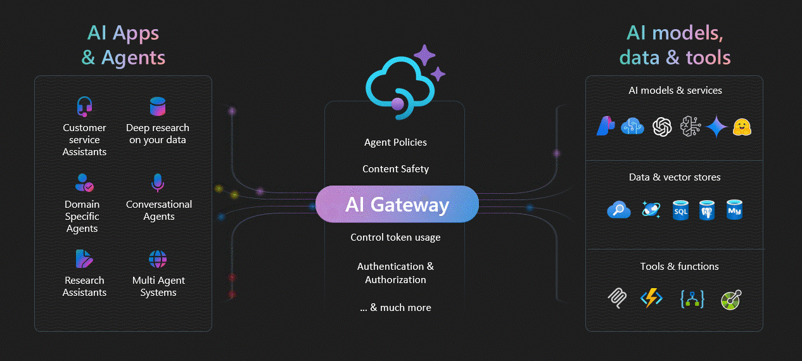

# APIM ❤️ OpenAI

The rapid pace of AI advances demands experimentation-driven approaches for organizations to remain at the forefront of the industry. With AI steadily becoming a game-changer for an array of sectors, maintaining a fast-paced innovation trajectory is crucial for businesses aiming to leverage its full potential. 

__AI services__ are predominantly accessed via __APIs__, underscoring the essential need for a robust and efficient API management strategy. This strategy is instrumental for maintaining control and governance over the consumption of __AI services__.

With the expanding horizons of __AI services__ and their seamless integration with __APIs__, there is a considerable demand for a comprehensive __AI Gateway__ concept, which broadens the core principles of API management. Aiming to accelerate the experimentation of advanced use cases and pave the road for further innovation in this rapidly evolving field. The well-architected principles of the __AI Gateway__ provides a framework for the confident deployment of __Intelligent Apps__ into production..

## AI Gateway

This repo explores the __AI Gateway__ concept through a series of experimental labs. [Azure API Management](https://learn.microsoft.com/en-us/azure/api-management/api-management-key-concepts) plays a crucial role within these labs, handling AI services APIs, with security, performance, reliability, cost control and overall operational efficiency. The primary focus is on [Azure OpenAI](https://learn.microsoft.com/en-us/azure/ai-services/openai/overview), which sets the standard reference for Large Language Models (LLM). However, the same principles could potentially be applied to any LLM.

## Labs

Acknowledging the rising dominance of Python, particularly in the realm of AI, along with the powerful experimental capabilities of Jupyter notebooks, the following labs are structured around Jupyter notebooks, with step-by-step instructions with Python scripts, Bicep files and APIM policies:

|  |  | |
| ---- | ----- | ----------- |
| [Request forwarding](labs/request-forwarding/request-forwarding.ipynb) |  | Playground to try forwarding requests to either an Azure OpenAI endpoint or a mock server. APIM uses the system managed identity to authenticate into the Azure OpenAI service. |
| [Backend circuit breaking](labs/backend-circuit-breaking/backend-circuit-breaking.ipynb)     |  | Playground to try the built-in [backend circuit breaker functionality of APIM](https://learn.microsoft.com/en-us/azure/api-management/backends?tabs=bicep) to either an Azure OpenAI endpoints or a mock server. |
| [Backend pool load balancing](labs/backend-pool-load-balancing/backend-pool-load-balancing.ipynb) |  | Playground to try the built-in load balancing [backend pool functionality of APIM](https://learn.microsoft.com/en-us/azure/api-management/backends?tabs=bicep) to either a list of Azure OpenAI endpoints or mock servers. |
| [Advanced load balancing](labs/advanced-load-balancing/advanced-load-balancing.ipynb) |  | Playground to try the advanced load balancing (based on a custom [APIM policy](https://learn.microsoft.com/en-us/azure/api-management/api-management-howto-policies)) to either a list of Azure OpenAI endpoints or mock servers. |

### Backlog of experiments
* Response streaming
* Vector searching
* Performance testing
* Token counting
* Semantic caching
* Cost tracking
* Content filtering
* Prompt logging
* Token throttling
* Function calling
* Prompt guarding

## Mock Server

The AI-Gateway Mock server is designed to mimic the behavior and responses of the OpenAI API, thereby creating an efficient simulation environment suitable for testing and development purposes on the integration with APIM and other use cases.
The [app.py](app.py) can be customized to tailor the Mock server to specific use cases.

* [Run locally or deploy to Azure](mock-server/mock-server.ipynb)

## Getting Started

### Prerequisites
- [Python 3.8 or later version](https://www.python.org/) installed
- [VS Code](https://code.visualstudio.com/) installed with the [Jupyter notebook extension](https://marketplace.visualstudio.com/items?itemName=ms-toolsai.jupyter) enabled
- [Azure CLI](https://learn.microsoft.com/en-us/cli/azure/install-azure-cli) installed
- [An Azure Subscription](https://azure.microsoft.com/en-us/free/) with Contributor permissions
- [Access granted to Azure OpenAI](https://aka.ms/oai/access) or just enable the mock service
- [Sign in to Azure with Azure CLI](https://learn.microsoft.com/en-us/cli/azure/authenticate-azure-cli-interactively)

### Quickstart

1. Navigate through the available labs and select one that best suits your needs. For starters we recommend the [request forwarding](labs/request-forwarding/request-forwarding.ipynb) with just the Azure CLI or the [backend pool load balancing](labs/backend-pool-load-balancing/backend-pool-load-balancing.ipynb) with Bicep.
2. Open the notebook, ensure that you meet the prerequisites and run the steps.
3. Tailor the experiment according to your requirements. If you wish to contribute to our collective work, we would appreciate your [submission of a pull request](CONTRIBUTING.MD).

## Resources

Numerous reference architectures, best practices and starter kits are available on this topic. Please refer to the resources provided if you need comprehensive solutions or a landing zone to initiate your project. We suggest leveraging the AI-Gateway labs to discover additional capabilities that can be integrated into the reference architectures.

- [AI Hub Gateway Landing Zone](https://github.com/mohamedsaif/ai-hub-gateway-landing-zone)
- [Azure OpenAI Using PTUs/TPMs With API Management - Using the Scaling Special Sauce](https://github.com/Azure/aoai-apim)
- [Manage Azure OpenAI using APIM](https://github.com/microsoft/AzureOpenAI-with-APIM) 
- [Setting up Azure OpenAI as a central capability with Azure API Management](https://github.com/Azure/enterprise-azureai)
- [Introduction to Building AI Apps](https://github.com/Azure/intro-to-intelligent-apps)

We believe that there may be valuable content that we are currently unaware of. We would greatly appreciate any suggestions or recommendations to enhance this list.
