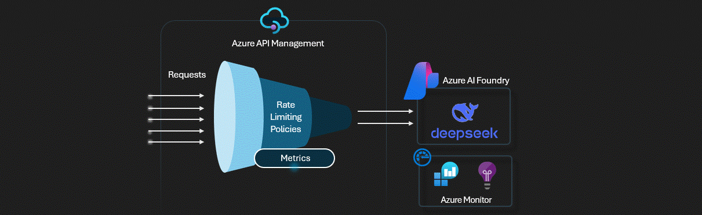

# APIM ❤️ AI Foundry

## [AI Foundry Deepseek lab](ai-foundry-deepseek.ipynb)

Playground to try the [Deepseek R1 model](https://azure.microsoft.com/en-us/blog/deepseek-r1-is-now-available-on-azure-ai-foundry-and-github/) via the AI Model Inference from [Azure AI Foundry](https://azure.microsoft.com/en-us/products/ai-foundry). This lab uses the [Azure AI Model Inference API](https://learn.microsoft.com/en-us/azure/ai-foundry/model-inference/how-to/inference?tabs=python) and two APIM LLM policies: [llm-token-limit](https://learn.microsoft.com/en-us/azure/api-management/llm-token-limit-policy) and [llm-emit-token-metric](https://learn.microsoft.com/en-us/azure/api-management/llm-emit-token-metric-policy).

[View policy configuration](policy.xml)

### Result

### Prerequisites

- [Python 3.12 or later version](https://www.python.org/) installed
- [Pandas Library](https://pandas.pydata.org/) and matplotlib installed
- [VS Code](https://code.visualstudio.com/) installed with the [Jupyter notebook extension](https://marketplace.visualstudio.com/items?itemName=ms-toolsai.jupyter) enabled
- [Azure CLI](https://learn.microsoft.com/cli/azure/install-azure-cli) installed
- [An Azure Subscription](https://azure.microsoft.com/free/) with Contributor permissions
- [Sign in to Azure with Azure CLI](https://learn.microsoft.com/cli/azure/authenticate-azure-cli-interactively)

### 🚀 Get started

Proceed by opening the [Jupyter notebook](ai-foundry-deepseek.ipynb), and follow the steps provided.

### 🗑️ Clean up resources

When you're finished with the lab, you should remove all your deployed resources from Azure to avoid extra charges and keep your Azure subscription uncluttered.
Use the [clean-up-resources notebook](clean-up-resources.ipynb) for that.
