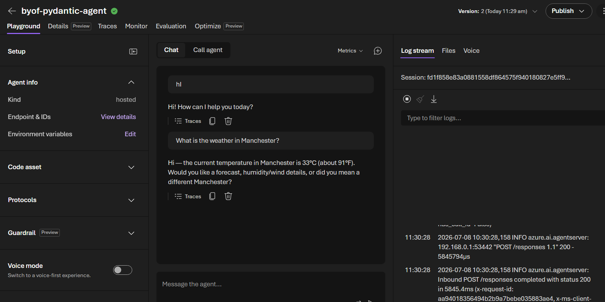

# Pydantic AI Agent on Foundry Hosted Agents

This sample code shows you how to run a Pydantic AI agent in Foundry Hosted Agents.

## What Is Included

- `01_hosted_agent_pydantic_setup.ipynb`: End-to-end setup workbook.
- `main.py`: Pydantic AI agent server implementation (Responses protocol + tool calling + streaming).
- `Dockerfile`: Container definition for hosting the agent in Foundry Hosted Agents.
- `requirements.txt`: Python dependencies for your Pydantic AI runtime.

## Get Started

1. Open and run `01_hosted_agent_pydantic_setup.ipynb` from top to bottom.
2. Build and push the container image to your Azure Container Registry.
3. Create a hosted agent version in your Foundry project.
4. Grant required permissions (including Foundry role assignment for the hosted agent identity).
5. Test prompts against the deployed hosted agent.

## Prerequisites

- Azure subscription with access to Azure AI Foundry and Azure Container Registry.
- Permission to push images to the target ACR repository.
- Permission to assign RBAC roles on the Foundry resource scope.
- Python environment with the dependencies required by your Pydantic AI app.

## Notes

- This sample routes model calls through APIM inference chat-completions.
- Configure AZURE_OPENAI_ENDPOINT to your APIM inference URL and set APIM_SUBSCRIPTION_KEY.
- The runtime sends the APIM subscription key in the api-key header for model calls.
- Use the notebook placeholders to provide your own project, registry, and deployment values.
