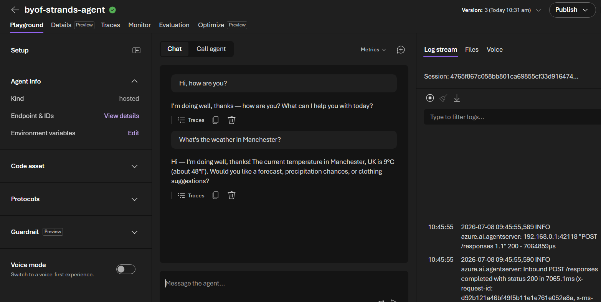

# Strands Agent on Foundry Hosted Agents

This sample code shows you how to run a Strands agent in Foundry Hosted Agents.

## What Is Included

- `main.py`: Strands agent server implementation (Responses protocol) with tool calling and streaming.
- `Dockerfile`: Container definition for hosting the agent in Foundry Hosted Agents.
- `01_hosted_agent_strands_setup.ipynb`: End-to-end setup workbook.
- `requirements.txt`: Python dependencies.

## Get Started

1. Open and run `01_hosted_agent_strands_setup.ipynb` from top to bottom.
2. Build and push the container image to your Azure Container Registry.
3. Create a hosted agent version in your Foundry project.
4. Grant required permissions (including Foundry role assignment for the hosted agent identity).
5. Test prompts against the deployed hosted agent.

## Prerequisites

- Azure subscription with access to Microsoft Foundry and Azure Container Registry.
- Permission to push images to the target ACR repository.
- Permission to assign RBAC roles on the Foundry resource scope.
- Python environment with the dependencies in `requirements.txt`.

## Notes

- This sample is configured for identity-based auth patterns (no hard-coded OpenAI API key in `main.py`).
- Use the notebook placeholders to provide your own project, registry, and deployment values.
