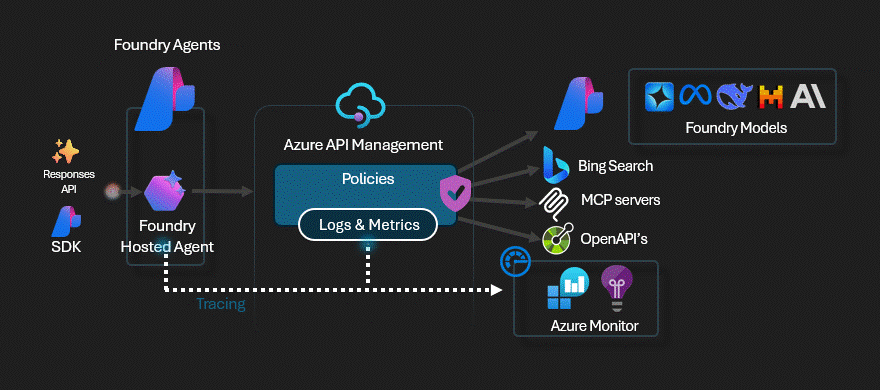

# APIM ❤️ AI Foundry

## [AI Foundry Hosted Agents lab](ai-foundry-hosted-agents.ipynb)

This lab demonstrates how to build, test, and deploy an **AI Foundry Hosted Agent** to Azure Container Apps (ACA). The architecture combines:

- **Two Azure AI Foundry projects**: one (`foundry-inference`) hosting the `gpt-4.1` model deployment, and one (`foundry-agent`) used as the hosted agent orchestration layer.
- **Azure API Management (Basicv2)**: routes inference requests to the `foundry-inference` project and exposes the Weather MCP server via a streamable MCP API.
- **Weather MCP Server**: a FastMCP streamable HTTP server deployed to ACA and exposed via APIM as an MCP tool for the agent.
- **Azure Container Apps**: hosts both the Weather MCP server and the Hosted Agent.
- **Azure Container Registry**: stores Docker images for both containers.

### Architecture

**Why this architecture matters?**

This architecture resembles a federated approach where the models and the tools are managed centrally by a platform team, where the AI Apps team would be responsible for the development of their agents.

The Models foundry is solely hosting Foundry models for inference, and some APIs are secured behind APIM.

The Agents foundry connects to the models and the tools (such as MCP, Bing Search, etc) via Foundry tools connections through APIM

The hosted agent is hosted on ACA and uses the connections available in the Agents Foundry without having to hold any credentials for the backend components, only via RBAC for the Agents Foundry.

The hosted agents could be built using any framework such Agent Framework, Langraph, or anytging cutom-built. This allows organisations to build a hybrid architecture that promotes interoprability and bringing all agents into the same Foundry Control plane.

- [Hosted Agents](https://learn.microsoft.com/en-us/azure/foundry/agents/concepts/hosted-agents?view=foundry)
- [Hosted Agents Samples](https://github.com/microsoft-foundry/foundry-samples/tree/main/samples/python/hosted-agents)
- [Azure AI Agent Server Samples](https://github.com/Azure/azure-sdk-for-python/tree/main/sdk/agentserver/azure-ai-agentserver-agentframework/samples)

### Prerequisites

- [Python 3.12 or later version](https://www.python.org/) installed
- [VS Code](https://code.visualstudio.com/) installed with the [Jupyter notebook extension](https://marketplace.visualstudio.com/items?itemName=ms-toolsai.jupyter) enabled
- [Python environment](https://code.visualstudio.com/docs/python/environments#_creating-environments) with the [requirements.txt](../../requirements.txt) or run `pip install -r requirements.txt` in your terminal
- [An Azure Subscription](https://azure.microsoft.com/free/) with [Contributor](https://learn.microsoft.com/en-us/azure/role-based-access-control/built-in-roles/privileged#contributor) + [RBAC Administrator](https://learn.microsoft.com/en-us/azure/role-based-access-control/built-in-roles/privileged#role-based-access-control-administrator) or [Owner](https://learn.microsoft.com/en-us/azure/role-based-access-control/built-in-roles/privileged#owner) roles
- [Azure CLI](https://learn.microsoft.com/cli/azure/install-azure-cli) installed and [Signed into your Azure subscription](https://learn.microsoft.com/cli/azure/authenticate-azure-cli-interactively)
- [Docker](https://www.docker.com/get-started/) installed and running (for building container images)

### 🚀 Get started

Proceed by opening the [Jupyter notebook](ai-foundry-hosted-agents.ipynb), and follow the steps provided.

### 🗑️ Clean up resources

When you're finished with the lab, you should remove all your deployed resources from Azure to avoid extra charges and keep your Azure subscription uncluttered.
Use the [clean-up-resources notebook](clean-up-resources.ipynb) for that.
