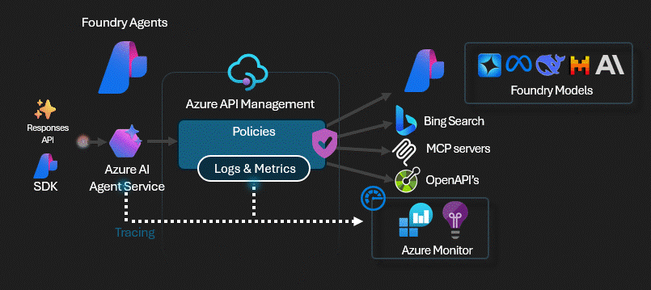

# APIM ❤️ Microsoft Foundry

## AI Foundry with APIM Model Gateway lab



This lab demonstrates how to configure **Azure API Management (APIM)** as a **Model Gateway** for **Azure AI Foundry**. By establishing this connection, you can leverage APIM's enterprise-grade capabilities including:

- 🔒 **Security & Authentication** - API keys, OAuth, JWT validation
- 📊 **Monitoring & Analytics** - Detailed metrics, logs, and distributed tracing  
- ⚡ **Performance** - Semantic caching, response compression
- 🛡️ **Governance** - Rate limiting, throttling, quotas
- 🔄 **Reliability** - Load balancing, circuit breakers, retries

### Architecture

The Model Gateway pattern enables Foundry Agents Service to route all model inference requests through APIM:

```
Foundry Agent → APIM Gateway (Model Gateway) → AI Services → OpenAI Models
                      ↓
              Policies, Monitoring,
              Rate Limiting, Caching
```

### What you'll deploy

- **Azure AI Foundry** - Hub and project with Azure AI Services
- **APIM Developer SKU** - API gateway with full enterprise features
- **OpenAI Model Deployments** - GPT-4o-mini model
- **Model Gateway Connection** - Connection from Foundry to APIM
- **Monitoring Stack** - Application Insights and Log Analytics

### Key Features

✅ **Model Gateway Connection** - Foundry uses APIM as the inference gateway  
✅ **Centralized Management** - Single control plane for all AI traffic  
✅ **Enterprise Policies** - Apply security, rate limiting, caching at the gateway  
✅ **Cost Optimization** - Track and control AI service consumption  
✅ **Multi-Backend Support** - Route to multiple AI Services with load balancing  

### Prerequisites

- [Python 3.12 or later version](https://www.python.org/) installed
- [VS Code](https://code.visualstudio.com/) installed with the [Jupyter notebook extension](https://marketplace.visualstudio.com/items?itemName=ms-toolsai.jupyter) enabled
- [Azure CLI](https://learn.microsoft.com/cli/azure/install-azure-cli) installed
- [An Azure Subscription](https://azure.microsoft.com/free/) with Contributor and RBAC Administrator (or Owner) permissions
- [Sign in to Azure with Azure CLI](https://learn.microsoft.com/cli/azure/authenticate-azure-cli-interactively)

### 🚀 Get started

Proceed by opening the [Jupyter notebook](foundry-ai-gateway.ipynb), and follow the steps provided.

### 📖 Learn more

- [Azure AI Foundry Documentation](https://learn.microsoft.com/azure/ai-studio/)
- [APIM as AI Gateway](https://learn.microsoft.com/azure/api-management/api-management-using-with-internal-vnet)
- [Model Context Protocol](https://modelcontextprotocol.io/)
- [Foundry Samples - Model Gateway Setup](https://github.com/microsoft-foundry/foundry-samples/tree/main/infrastructure/infrastructure-setup-bicep/01-connections/model-gateway)

### 🗑️ Clean up resources

When you're finished with the lab, you should remove all your deployed resources from Azure to avoid extra charges and keep your Azure subscription uncluttered.
Use the [clean-up-resources notebook](clean-up-resources.ipynb) for that.
