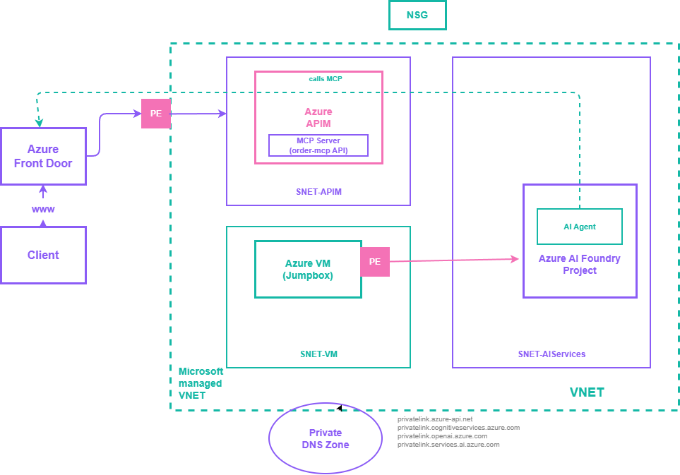
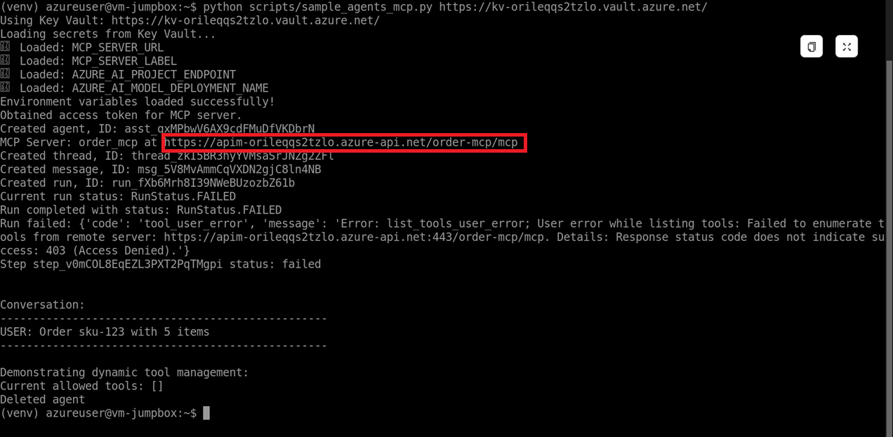
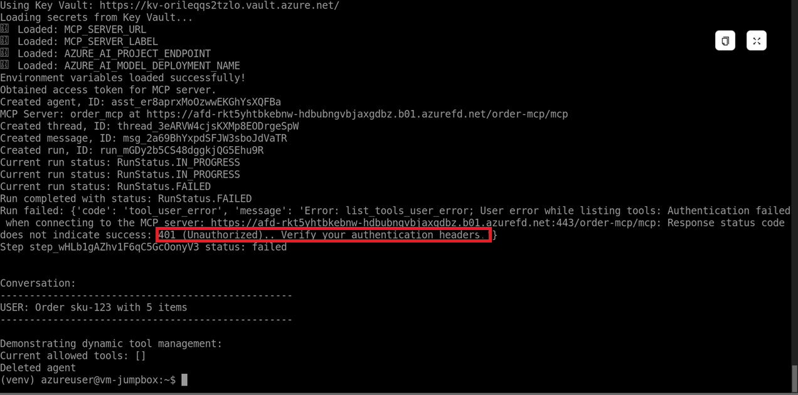

# Azure AI Foundry Private Connectivity Lab

A hands-on lab demonstrating secure agent consumption through private networking with Azure AI Foundry, API Management, and Front Door. Features MCP (Model Context Protocol) integration, private endpoints, and agent-based interactions. MCP servers are only accessible through the frontdoor. 


## 🏗️ Architecture

This lab demonstrates a fully private AI infrastructure:



Core Components:
- **Azure AI Foundry**: AI Services account with private endpoint access only
- **Azure API Management (APIM)**: Deployed in VNet, manages traffic to AI services via private endpoints
- **Azure Front Door**: Premium tier with Private Link to APIM - the only publicly accessible endpoint
- **Azure Key Vault**: Stores secrets, accessible only from private network
- **Jumpbox VM**: Ubuntu VM with managed identity for testing from private network
- **MCP Integration**: Model Context Protocol server exposed through APIM

**Network Flow**: Client → Front Door (Public) → Private Link → APIM (Private VNet) → Private Endpoint → AI Foundry

## 📋 Prerequisites

- [Python 3.11 or later](https://www.python.org/) installed locally
- [VS Code](https://code.visualstudio.com/) with [Jupyter extension](https://marketplace.visualstudio.com/items?itemName=ms-toolsai.jupyter) enabled
- [Azure CLI](https://learn.microsoft.com/cli/azure/install-azure-cli) installed and authenticated
- [An Azure Subscription](https://azure.microsoft.com/free/) with Contributor permissions

## 🚀 Deployment

### 1. Clone and Setup

```bash
git clone <repository-url>
cd AI-Gateway
pip install -r requirements.txt
```

### 2. Deploy Infrastructure

Open the [Jupyter notebook](notebooks/private-connectivity.ipynb) and execute the cells to:

1. **Initialize variables** - Set deployment name, locations, and model configurations
2. **Create resource group** - Provision the Azure resource group
3. **Deploy Bicep template** - Deploy all infrastructure (15-20 minutes):
   - Virtual Network with subnets
   - Azure AI Foundry with private endpoint
   - APIM integrated in VNet
   - Front Door with Private Link
   - Key Vault with secrets
   - Jumpbox VM with managed identity
   - MCP API configuration

4. **Approve Private Link** - Approve Front Door connection to APIM
5. **Disable APIM public access** - Lock down APIM to private network only

### 3. Verify Deployment Outputs

The deployment provides:
- `frontDoorEndpointHostName` - Public endpoint for testing
- `apimResourceGatewayURL` - Private APIM URL (inaccessible from internet)
- `keyVaultUrl` - Key Vault URL for secrets
- `aiFoundryProjectEndpoint` - AI Foundry project endpoint

## 🧪 Testing from Jumpbox

### Connect to Jumpbox

Use Azure Bastion to connect to the VM:

```bash
az network bastion ssh \
  --name bastion-host \
  --resource-group <resource-group> \
  --target-resource-id <vm-resource-id> \
  --auth-type password \
  --username azureuser
```

Or connect via the Azure Portal: Navigate to the VM → Connect → Bastion

### Create Python Scripts

Once connected to the jumpbox, create the required scripts:

#### 1. Create `scripts/load_env_from_kv.py`
```bash 
cat > ~/scripts/load_env_from_kv.py << 'EOF'
# Paste content of agent/load_env_from_kv.py here
EOF
```

#### 2. Create `scripts/sample_agents_mcp.py`
```bash 
cat > ~/scripts/sample_agents_mcp.py << 'EOF'
# Paste content of agent/sample_agents_mcp.py here
EOF
```

### Run the Agent

```bash
# Activate virtual environment
source ~/venv/bin/activate

# Get Key Vault URL from deployment outputs
KEY_VAULT_URL="https://kv-xxxxx.vault.azure.net/"

# Run the MCP agent
python3 ~/scripts/sample_agents_mcp.py $KEY_VAULT_URL
```

The script will:
1. Load secrets from Key Vault using managed identity
2. Create an AI agent with MCP tools
3. Send a test message ("Order sku-123 with 5 items")
4. Process MCP tool calls through APIM
5. Display the conversation and results

### Test the Agent

Now you can test the agent: 

#### Test 1: Public Access to APIM

- Access the APIM endpoint directly through its public URL
- Expected Result: Request should be blocked or restricted, demonstrating that direct APIM access is protected



##### Test 2: Unauthorized MCP Access

- Attempt to call the MCP server without an authorization token
- Expected Result: 401 Unauthorized, validating OAuth enforcement

 

##### Test 3: Authorized Access via Front Door

- Access the MCP server through Front Door with a valid authorization token
- Expected Result: Successful response, demonstrating the complete secure flow: Client → Front Door → Private Link → APIM → MCP Server


## 🧹 Clean Up Resources

When finished, delete all resources to avoid charges: <br>
Use [clean-up-resources notebook](./clean-up-resources.ipynb).

## 📚 Additional Resources

- [Azure API Management Private Endpoints](https://learn.microsoft.com/azure/api-management/private-endpoint)
- [Azure Front Door Private Link](https://learn.microsoft.com/azure/frontdoor/private-link)
- [Azure AI Foundry Documentation](https://learn.microsoft.com/azure/ai-services/)
- [Model Context Protocol](https://modelcontextprotocol.io/)
