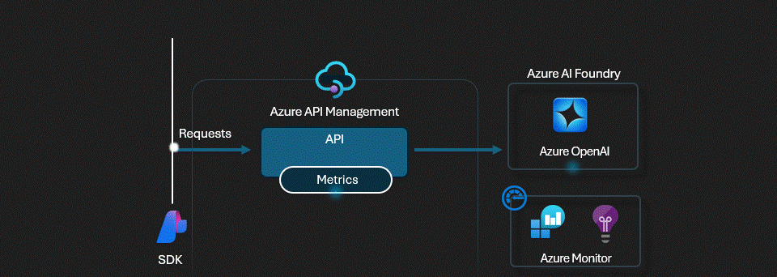

# APIM ❤️ OpenAI

## AI Foundry SDK lab

This experimentation involves integrating [Azure AI Foundry SDK](https://learn.microsoft.com/azure/ai-studio/how-to/develop/sdk-overview?tabs=async&pivots=programming-language-python) with APIM. The OpenAI connection in the AI Foundry project includes an APIM endpoint and subscription, allowing client application requests to seamlessly route through APIM when utilizing the AI Foundry SDK.

### Prerequisites

- [Python 3.8 or later version](https://www.python.org/) installed
- [VS Code](https://code.visualstudio.com/) installed with the [Jupyter notebook extension](https://marketplace.visualstudio.com/items?itemName=ms-toolsai.jupyter) enabled
- [Azure CLI](https://learn.microsoft.com/cli/azure/install-azure-cli) installed
- [An Azure Subscription](https://azure.microsoft.com/free/) with Contributor permissions
- [Sign in to Azure with Azure CLI](https://learn.microsoft.com/cli/azure/authenticate-azure-cli-interactively)

### 🚀 Get started

Proceed by opening the [Jupyter notebook](ai-foundry-sdk.ipynb), and follow the steps provided.

### 🗑️ Clean up resources

When you're finished with the lab, you should remove all your deployed resources from Azure to avoid extra charges and keep your Azure subscription uncluttered.
Use the [clean-up-resources notebook](clean-up-resources.ipynb) for that.
