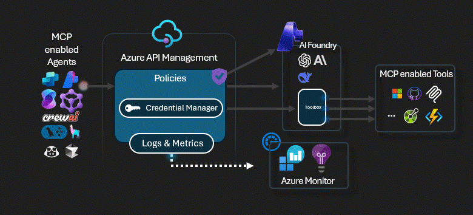

# APIM ❤️ AI Foundry

## [AI Foundry Toolbox lab](ai-foundry-toolbox.ipynb)

A [Foundry Toolbox](https://learn.microsoft.com/azure/foundry/agents/how-to/tools/toolbox) is a managed resource in Azure AI Foundry that bundles tools—MCP servers, Web Search, Azure AI Search, Code Interpreter, and more—into a single MCP-compatible endpoint. This lab places Azure API Management in front of that endpoint, so agents use an APIM subscription key instead of managing Foundry credentials, while APIM enforces governance, rate limiting, and observability over every tool call.

Key scenarios covered:

- Deploy APIM and Azure AI Foundry using Bicep
- Deploy the vet-toolbox MCP server as an Azure Functions Flex Consumption app (no container needed)
- Create a Foundry Toolbox with an MCP tool via the azure-ai-projects SDK
- Configure APIM native MCP proxy to the Toolbox MCP endpoint (subscription key → managed-identity Entra token)
- Verify tool discovery and run chat completions with Toolbox tools routed through APIM

### Prerequisites

- [Python 3.12 or later](https://www.python.org/) installed
- [VS Code](https://code.visualstudio.com/) installed with the [Jupyter notebook extension](https://marketplace.visualstudio.com/items?itemName=ms-toolsai.jupyter) enabled
- [uv](https://docs.astral.sh/uv/) — run `uv sync` from the repo root to install dependencies
- [An Azure Subscription](https://azure.microsoft.com/free/) with [Contributor](https://learn.microsoft.com/en-us/azure/role-based-access-control/built-in-roles/privileged#contributor) + [RBAC Administrator](https://learn.microsoft.com/en-us/azure/role-based-access-control/built-in-roles/privileged#role-based-access-control-administrator) or [Owner](https://learn.microsoft.com/en-us/azure/role-based-access-control/built-in-roles/privileged#owner) roles
- [Azure CLI](https://learn.microsoft.com/cli/azure/install-azure-cli) installed and [signed in to your Azure subscription](https://learn.microsoft.com/cli/azure/authenticate-azure-cli-interactively)

### 🚀 Get started

Proceed by opening the [Jupyter notebook](ai-foundry-toolbox.ipynb), and follow the steps provided.

### 🗑️ Clean up resources

When you're finished with the lab, you should remove all your deployed resources from Azure to avoid extra charges and keep your Azure subscription uncluttered.
Use the [clean-up-resources notebook](clean-up-resources.ipynb) for that.
