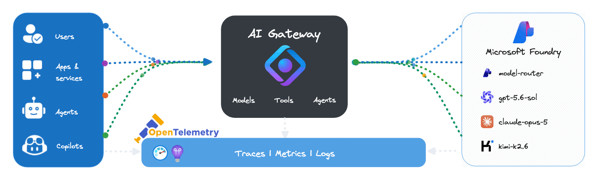

# AI Gateway ❤️ Foundry

## [AI Gateway Foundry Models lab](aigw-foundry-models.ipynb)

Playground to try the [**AI Gateway tier of Azure API Management (public preview)**](https://techcommunity.microsoft.com/blog/integrationsonazureblog/ai-gateway-tier-of-api-management-now-in-public-preview/4540170) — a purpose-built experience for publishing and governing AI models and MCP servers. This lab publishes Microsoft Foundry models through a gateway-managed endpoint, where governance is configured through policy cards (token rate limits, quotas, Azure AI Content Safety, and model fallback) rather than XML. Applications call the published models under a single stable endpoint using standard formats such as OpenAI Chat Completions and Responses, while OpenTelemetry-based token-usage metrics flow to the Application Insights resource.

> [!NOTE]
> The AI Gateway tier is in **public preview** and available in **East US 2** and **Sweden Central**. Preview features are provided without an SLA and are not recommended for production workloads.

### What you'll do

- Deploy the AI Gateway, Foundry models, subscription keys and monitoring with [Bicep](main.bicep)
- Call a published model with the OpenAI **Chat Completions** format (structured output)
- Call the same model with the OpenAI **Responses** format
- **Stream** a response and measure time-to-first-token (TTFT)
- Validate **authentication** — missing / invalid keys are rejected with HTTP 401
- Demonstrate the **token rate-limit** policy (leaky bucket) and visualize it
- Analyze **token-usage** metrics via managed Prometheus, broken down by model and subscription

### Prerequisites

- [Python 3.12 or later version](https://www.python.org/) installed
- [VS Code](https://code.visualstudio.com/) installed with the [Jupyter notebook extension](https://marketplace.visualstudio.com/items?itemName=ms-toolsai.jupyter) enabled
- [uv](https://docs.astral.sh/uv/) — run `uv sync` from the repo root to install dependencies
- [An Azure Subscription](https://azure.microsoft.com/free/) with [Contributor](https://learn.microsoft.com/en-us/azure/role-based-access-control/built-in-roles/privileged#contributor) + [RBAC Administrator](https://learn.microsoft.com/en-us/azure/role-based-access-control/built-in-roles/privileged#role-based-access-control-administrator) or [Owner](https://learn.microsoft.com/en-us/azure/role-based-access-control/built-in-roles/privileged#owner) roles
- [Azure CLI](https://learn.microsoft.com/cli/azure/install-azure-cli) installed and [Signed into your Azure subscription](https://learn.microsoft.com/cli/azure/authenticate-azure-cli-interactively)

### 🚀 Get started

Proceed by opening the [Jupyter notebook](aigw-foundry-models.ipynb), and follow the steps provided.

### 🗑️ Clean up resources

When you're finished with the lab, you should remove all your deployed resources from Azure to avoid extra charges and keep your Azure subscription uncluttered.
Use the [clean-up-resources notebook](clean-up-resources.ipynb) for that.
