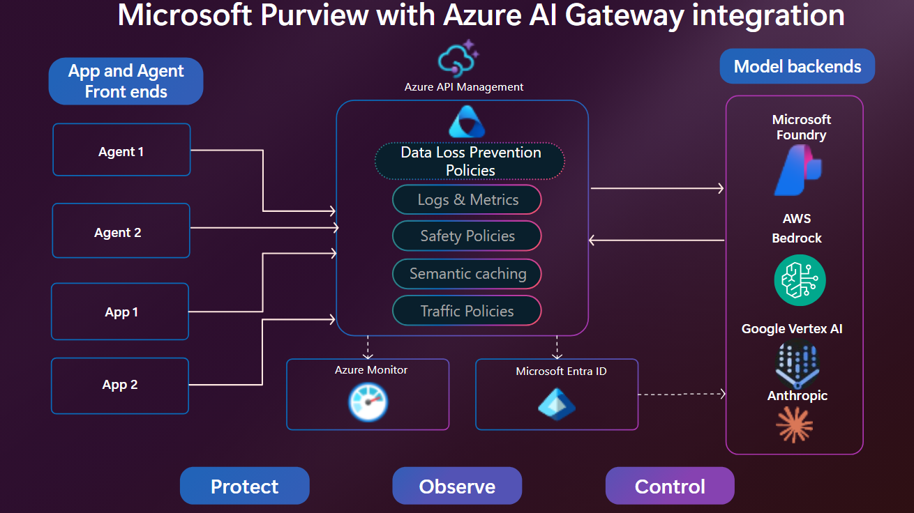

# APIM ❤️ Microsoft Purview

## [Microsoft Purview DLP at the AI Gateway lab](apim-purview-dlp.ipynb)

[](apim-purview-dlp.ipynb)

Playground to enforce [Microsoft Purview](https://learn.microsoft.com/purview/purview) Data Loss Prevention on prompts and responses at the AI gateway using the [Purview `processContent` API](https://learn.microsoft.com/graph/api/userprotectionscopecontainer-computeinheritance). The gateway calls Purview twice per turn — once on the inbound prompt (Gate 1, `uploadText`) and once on the outbound response (Gate 3, `downloadText`) — via a shared APIM policy fragment applied identically to two backends: **Microsoft Foundry** (gpt-4.1) and **Amazon Bedrock** (Nova 2 Lite, signed with SigV4 in the APIM policy, no Lambda). Both routes emit prompt/response audit rows to a Log Analytics custom table (`AIGatewayContent_CL`) protected by granular RBAC, and a KQL query stitches model PAYG spend and Purview PAYG spend into one per-user, per-model, per-backend row.

[View Foundry policy](foundry-hrpolicy.policy.xml) · [View Bedrock policy](bedrock-expense.policy.xml) · [View shared Purview fragment](purview-processcontent.fragment.xml) · [View content-log fragment](emit-content-log.fragment.xml)

### Prerequisites

- [Python 3.12 or later version](https://www.python.org/) installed
- [VS Code](https://code.visualstudio.com/) installed with the [Jupyter notebook extension](https://marketplace.visualstudio.com/items?itemName=ms-toolsai.jupyter) enabled
- [uv](https://docs.astral.sh/uv/) — run `uv sync` from the repo root to install dependencies
- [An Azure Subscription](https://azure.microsoft.com/free/) with [Contributor](https://learn.microsoft.com/en-us/azure/role-based-access-control/built-in-roles/privileged#contributor) on the target resource group. To let the Bicep create the role assignments it needs (APIM system-assigned MI → **Monitoring Metrics Publisher** on the audit DCR, and the optional **Log Analytics Data Reader** on the workspace), the deploying identity also needs [RBAC Administrator](https://learn.microsoft.com/en-us/azure/role-based-access-control/built-in-roles/privileged#role-based-access-control-administrator) or [Owner](https://learn.microsoft.com/en-us/azure/role-based-access-control/built-in-roles/privileged#owner) on that scope. If you don't hold those, set `enableRbacAssignments=false` when deploying and grant the DCR role out-of-band after the resources exist.
- [Azure CLI](https://learn.microsoft.com/cli/azure/install-azure-cli) installed and [Signed into your Azure subscription](https://learn.microsoft.com/cli/azure/authenticate-azure-cli-interactively)

#### Microsoft Purview prerequisites

- A **Microsoft Purview tenant** with the `processContent` API enabled and **Microsoft Purview Audit** turned on. Reference: [Configure Microsoft Purview solutions in DSPM for AI for custom AI applications](https://learn.microsoft.com/purview/developer/configurepurview).
- A **DLP policy for custom AI apps** scoped to the gateway's Entra app registration (created below) that blocks the sensitive information types you want to demo (this lab uses **Credit Card Number** + **U.S. Social Security Number (SSN)**). The [`setup/Create-LabDlpPolicy.ps1`](setup/Create-LabDlpPolicy.ps1) script in this lab creates it end-to-end via `New-DlpCompliancePolicy` + `New-DlpComplianceRule` on the `Application` enforcement plane; it is a thin wrapper around the shared sample [`microsoft/purview-api-samples/DLPforCustomAIApps`](https://github.com/microsoft/purview-api-samples/tree/main/DLPforCustomAIApps).
- Prereqs to run that script:
  - [**PowerShell 7+**](https://learn.microsoft.com/powershell/scripting/install/installing-powershell)
  - The [**ExchangeOnlineManagement**](https://www.powershellgallery.com/packages/ExchangeOnlineManagement) module: `Install-Module ExchangeOnlineManagement -Scope CurrentUser`
  - A Purview role that can manage DLP policies — [**Compliance Administrator**](https://learn.microsoft.com/purview/purview-permissions) (or Global Administrator). `Compliance Data Administrator` is **not** sufficient to create rules on the `Application` plane.
- New DLP policies typically become active within a few minutes but may take up to an hour to propagate. Wait for propagation before running the block-scenario smoke tests.

#### Microsoft Entra app registration (gateway service principal)

The gateway needs a delegated Graph identity to call `processContent` on behalf of the signed-in user. Create it once, before running the notebook:

```powershell
# Create the app registration
az ad app create --display-name "apim-purview-dlp-gateway" --sign-in-audience AzureADMyOrg
$appId = az ad app list --display-name "apim-purview-dlp-gateway" --query "[0].appId" -o tsv

# Add delegated Microsoft Graph permissions:
#   Content.Process.User            for the dataSecurityAndGovernance/processContent call itself
#   ProtectionScopes.Compute.User   for Gate 1 (uploadText) and Gate 3 (downloadText) scope resolution
#   ContentActivity.Write           for the processContent audit trail
az ad app permission add --id $appId --api 00000003-0000-0000-c000-000000000000 --api-permissions `
    "1d787a13-f750-4ad6-875a-fcbd2725596b=Scope" `
    "4fc04d16-a9fc-4c5e-8da4-79b6c33638a4=Scope" `
    "948caae6-152a-48cd-a746-4844af30e8e9=Scope"

# Grant admin consent (requires Global Admin or Cloud Application Admin)
az ad app permission admin-consent --id $appId

# Create a client secret and record it — you will paste it into the notebook
az ad app credential reset --id $appId --display-name "notebook" --years 1
```

#### Amazon Bedrock prerequisites

- An AWS account with a **dedicated IAM user** (never the AWS account root user) scoped to the `bedrock:InvokeModel` action on the specific model ARN you plan to call. A least-privilege inline policy:

    ```json
    {
      "Version": "2012-10-17",
      "Statement": [{
        "Effect": "Allow",
        "Action": "bedrock:InvokeModel",
        "Resource": [
          "arn:aws:bedrock:us-east-1::foundation-model/amazon.nova-2-lite-v1:0",
          "arn:aws:bedrock:us-east-1:*:inference-profile/us.amazon.nova-2-lite-v1:0"
        ]
      }]
    }
    ```

- Bedrock **model access** enabled for that model in the region you choose (default: `us-east-1`, model: `us.amazon.nova-2-lite-v1:0`). Enable it once in the Bedrock console under **Model access**.
- An IAM access key ID + secret access key for that user — you will paste them into the notebook. APIM stores them as secure named values and signs each Bedrock request with SigV4 inside the policy; no Lambda or API Gateway is required.

#### Microsoft Foundry prerequisites

- An existing Microsoft Foundry project with a deployed model (default: `gpt-4.1`). You will provide the project endpoint (e.g. `<project>.services.ai.azure.com/api/projects/<projectName>`) and deployment name in the notebook.
- **Post-deploy RBAC (required for the Foundry leg):** the Foundry project usually lives outside the lab resource group, so the Bicep cannot grant its role assignment automatically. After the deployment finishes, grant the APIM system-assigned managed identity the **Cognitive Services User** role on the Foundry project resource. Without this, the Foundry leg returns 401 from `authentication-managed-identity`.

    ```powershell
    # Replace <apimName>, <rgApim>, and <foundryProjectResourceId>
    $apimMi = az apim show -g <rgApim> -n <apimName> --query 'identity.principalId' -o tsv
    az role assignment create `
        --assignee-object-id $apimMi `
        --assignee-principal-type ServicePrincipal `
        --role 'Cognitive Services User' `
        --scope <foundryProjectResourceId>
    ```

### 🚀 Get started

Proceed by opening the [Jupyter notebook](apim-purview-dlp.ipynb), and follow the steps provided.

### ⚠ Audit-trail data protection

The `emit-content-log` fragment writes the full prompt and full response to
the custom Log Analytics table `AIGatewayContent_CL` **before** the 403
short-circuit fires. That is intentional — a DLP audit trail that only
records the turns Purview *let through* has no forensic value — but it
means `AIGatewayContent_CL` will contain the exact CC / SSN strings that
Purview blocked. Consequences:

- The table is provisioned with ABAC-scoped Log Analytics reader access
  in [main.bicep](main.bicep); treat that RBAC scope like the sensitive-data table it is.
- If your compliance posture forbids storing raw matched content at all,
  add a redact step in `emit-content-log.fragment.xml` that replaces
  `content-text` with a hash or a `[REDACTED:<reason>]` marker when
  `content-purview-blocked == "true"`. The token counts, verdict, user,
  and correlation-id still populate the row so cost / usage KQL keeps
  working.

### 💰 Estimated infrastructure cost

Running-cost estimate for the lab resources deployed by the Bicep, in `eastus`, idle (no traffic), as of the deploy date. Public list prices; verify against the [Azure pricing calculator](https://azure.microsoft.com/pricing/calculator/) for your region and currency.

| Resource                                                     | SKU / Tier             | Approx. cost      |
| ------------------------------------------------------------ | ---------------------- | ----------------- |
| Azure API Management                                         | **StandardV2**         | **~$23 / day**    |
| Log Analytics workspace + Data Collection Endpoint / Rule    | PAYG (pay-per-GB)      | < $0.10 / day idle |
| Application Insights (linked to the workspace)               | PAYG                   | < $0.05 / day idle |
| Total (idle)                                                 |                        | **~$23 / day**    |

Traffic-driven costs (per turn) are additive and small:

- **Model** — per-token to Microsoft Foundry (gpt-4.1) or Amazon Bedrock (Nova 2 Lite).
- **Purview `processContent`** — 2 calls per turn (Gate 1 + Gate 3) at `$0.00005 / request` = `$0.0001 / turn`.
- **Purview audit** — 1 record per turn at `$0.000015 / record`.

The APIM StandardV2 hourly charge is the dominant driver whether or not the lab is being used. **Delete the resource group as soon as you finish the smoke tests** (see below) to avoid surprises.

### 🗑️ Clean up resources

When you're finished with the lab, you should remove all your deployed resources from Azure to avoid extra charges and keep your Azure subscription uncluttered.
Use the [clean-up-resources notebook](clean-up-resources.ipynb) for that. The Entra app registration created above is **not** removed by the notebook — delete it manually if you no longer need it:

```powershell
az ad app delete --id $appId
```
