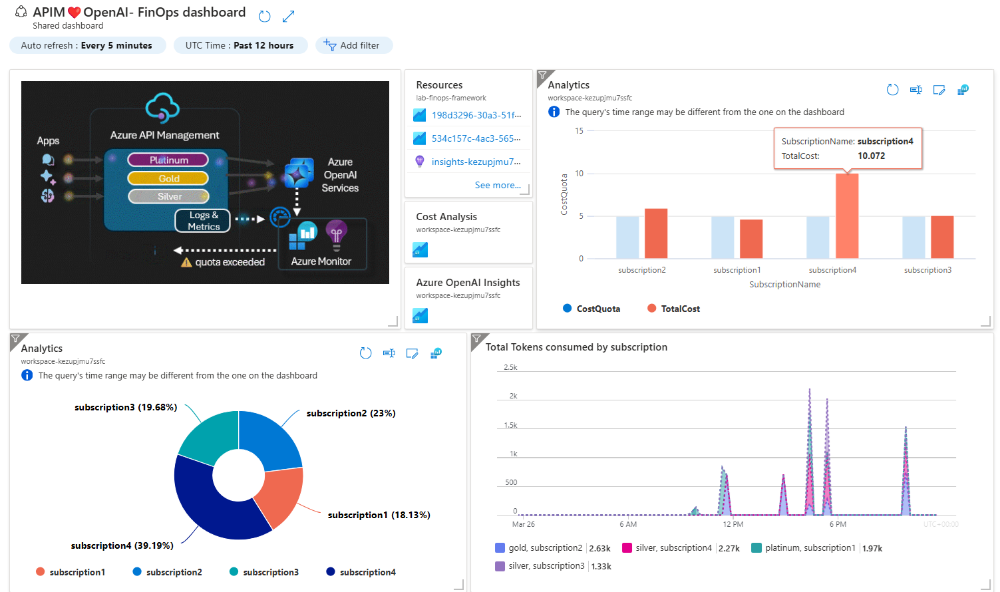

# APIM ❤️ FinOps

## [FinOps Framework lab](finops-framework.ipynb)

This playground leverages the [FinOps Framework](https://www.finops.org/framework/) and Azure API Management to control AI costs. It uses the [token limit](https://learn.microsoft.com/en-us/azure/api-management/azure-openai-token-limit-policy) policy for each [product](https://learn.microsoft.com/en-us/azure/api-management/api-management-howto-add-products?tabs=azure-portal&pivots=interactive) and integrates [Azure Monitor alerts](https://learn.microsoft.com/en-us/azure/azure-monitor/alerts/alerts-overview) with [Logic Apps](https://learn.microsoft.com/en-us/azure/azure-monitor/alerts/alerts-logic-apps?tabs=send-email) to automatically disable APIM [subscriptions](https://learn.microsoft.com/en-us/azure/api-management/api-management-subscriptions) that exceed cost quotas.

### Result

### Prerequisites

- [Python 3.12 or later version](https://www.python.org/) installed
- [Pandas Library](https://pandas.pydata.org) installed
- [VS Code](https://code.visualstudio.com/) installed with the [Jupyter notebook extension](https://marketplace.visualstudio.com/items?itemName=ms-toolsai.jupyter) enabled
- [Azure CLI](https://learn.microsoft.com/cli/azure/install-azure-cli) installed
- [An Azure Subscription](https://azure.microsoft.com/free/) with Contributor permissions
- [Access granted to Azure OpenAI](https://aka.ms/oai/access)
- [Sign in to Azure with Azure CLI](https://learn.microsoft.com/cli/azure/authenticate-azure-cli-interactively)

### 🚀 Get started

Proceed by opening the [Jupyter notebook](finops-framework.ipynb), and follow the steps provided.

### 🗑️ Clean up resources

When you're finished with the lab, you should remove all your deployed resources from Azure to avoid extra charges and keep your Azure subscription uncluttered.
Use the [clean-up-resources notebook](clean-up-resources.ipynb) for that.
