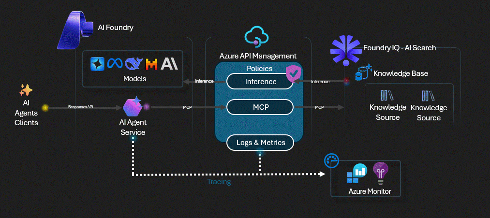

# APIM ❤️ Foundry IQ

## [Foundry IQ Agent Service Integration lab](foundry-iq-agent-svc.ipynb)

This lab integrates the **Foundry Agent Service** with a **Foundry IQ Knowledge Base** through **MCP (Model Context Protocol)**, with **Azure API Management** serving as the AI Gateway for all agent inference and embedding traffic.

### What you'll build

1. **Azure AI Search Knowledge Base** — Foundry IQ agentic retrieval pipeline with vector + semantic search
2. **APIM AI Gateway** — Managed identity auth, token metrics emission for all OpenAI traffic
3. **Foundry Agent** — Agent with `knowledge_base_retrieve` MCP tool for grounded answers with citations
4. **Two invocation patterns** — Conversations API (simple) and Classic Agent API (multi-turn threads)

### Key APIM integration points

| Traffic Path | APIM Feature |
|-------------|--------------|
| Embedding generation (vectorizer + upload) | Token metrics, managed identity auth |
| Agent inference (chat completions) | Token rate limiting, load balancing |
| All OpenAI traffic | Centralized observability via Application Insights |

### Prerequisites

- [Python 3.12 or later version](https://www.python.org/) installed
- [VS Code](https://code.visualstudio.com/) installed with the [Jupyter notebook extension](https://marketplace.visualstudio.com/items?itemName=ms-toolsai.jupyter) enabled
- [Python environment](https://code.visualstudio.com/docs/python/environments#_creating-environments) with the [requirements.txt](../../requirements.txt) or run `pip install -r requirements.txt` in your terminal
- [An Azure Subscription](https://azure.microsoft.com/free/) with [Contributor](https://learn.microsoft.com/en-us/azure/role-based-access-control/built-in-roles/privileged#contributor) + [RBAC Administrator](https://learn.microsoft.com/en-us/azure/role-based-access-control/built-in-roles/privileged#role-based-access-control-administrator) or [Owner](https://learn.microsoft.com/en-us/azure/role-based-access-control/built-in-roles/privileged#owner) roles
- [Azure CLI](https://learn.microsoft.com/cli/azure/install-azure-cli) installed and [Signed into your Azure subscription](https://learn.microsoft.com/cli/azure/authenticate-azure-cli-interactively)

### 🚀 Get started

Proceed by opening the [Jupyter notebook](foundry-iq-agent-svc.ipynb), and follow the steps provided.

### 🗑️ Clean up resources

When you're finished with the lab, you should remove all your deployed resources from Azure to avoid extra charges and keep your Azure subscription uncluttered.
Use the [clean-up-resources notebook](clean-up-resources.ipynb) for that.
