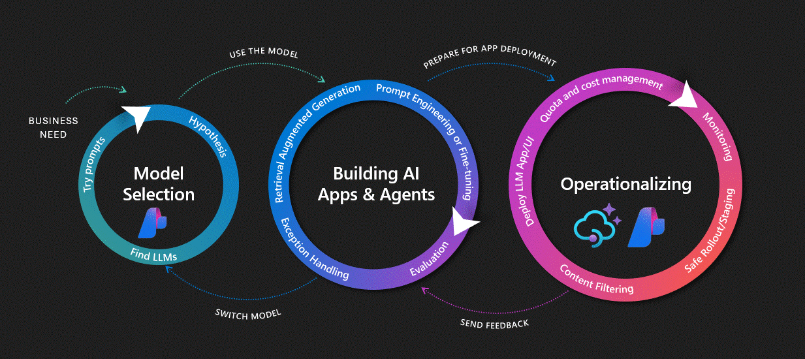

# APIM ❤️ Microsoft Foundry

## [Foundry Models Evals lab](foundry-models-evals.ipynb)

Playground to experiment with [Microsoft Foundry cloud evaluations](https://learn.microsoft.com/en-us/azure/ai-foundry/how-to/develop/cloud-evaluation). This lab demonstrates how to extract LLM request/response data from Azure API Management's built-in logging (`ApiManagementGatewayLlmLog`) and use it as input for running evaluations in Microsoft Foundry.

### Key Features

- **Extract LLM logs from APIM**: Query `ApiManagementGatewayLlmLog` to retrieve prompts and completions
- **Transform to evaluation format**: Convert logs to JSONL format compatible with Foundry evaluations
- **Run cloud evaluations**: Use Microsoft Foundry SDK to run evaluations with built-in evaluators
- **Built-in evaluators**: Coherence, fluency, groundedness, and more

### Prerequisites

- [Python 3.12 or later version](https://www.python.org/) installed
- [VS Code](https://code.visualstudio.com/) installed with the [Jupyter notebook extension](https://marketplace.visualstudio.com/items?itemName=ms-toolsai.jupyter) enabled
- [Python environment](https://code.visualstudio.com/docs/python/environments#_creating-environments) with the [requirements.txt](../../requirements.txt) or run `pip install -r requirements.txt` in your terminal
- [An Azure Subscription](https://azure.microsoft.com/free/) with [Contributor](https://learn.microsoft.com/en-us/azure/role-based-access-control/built-in-roles/privileged#contributor) + [RBAC Administrator](https://learn.microsoft.com/en-us/azure/role-based-access-control/built-in-roles/privileged#role-based-access-control-administrator) or [Owner](https://learn.microsoft.com/en-us/azure/role-based-access-control/built-in-roles/privileged#owner) roles
- [Azure CLI](https://learn.microsoft.com/cli/azure/install-azure-cli) installed and [Signed into your Azure subscription](https://learn.microsoft.com/cli/azure/authenticate-azure-cli-interactively)

### 🚀 Get started

Proceed by opening the [Jupyter notebook](foundry-models-evals.ipynb), and follow the steps provided.

### 🗑️ Clean up resources

When you're finished with the lab, you should remove all your deployed resources from Azure to avoid extra charges and keep your Azure subscription uncluttered.
Use the [clean-up-resources notebook](clean-up-resources.ipynb) for that.
