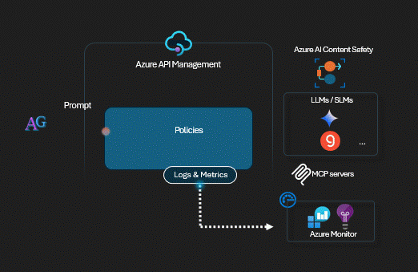

# APIM ❤️ GenAI Everywhere

## Gemini + MCP Agents + Content Safety lab

Playground to experiment the [Model Context Protocol](https://modelcontextprotocol.io/) with Azure API Management to enable plug & play of tools to LLMs whilst integrating with 3rd party models such as [Gemini models](https://ai.google.dev/gemini-api/docs). 
This lab includes the following MCP servers:
- Basic oncall service: provides a tool to get a list of random people currently on-call with their status and time zone.
- Basic weather service: provide tools to get cities for a given country and retrieve random weather information for a specified city.

The lab also explores who to enforce Content Safety and Tokens metrics to create a single pane of glass for all your AI Gateway needs.

### Prerequisites

- [Python 3.12 or later version](https://www.python.org/) installed
- [VS Code](https://code.visualstudio.com/) installed with the [Jupyter notebook extension](https://marketplace.visualstudio.com/items?itemName=ms-toolsai.jupyter) enabled
- [Python environment](https://code.visualstudio.com/docs/python/environments#_creating-environments) with the [requirements.txt](../../requirements.txt) or run `pip install -r requirements.txt` in your terminal
- [An Azure Subscription](https://azure.microsoft.com/free/) with [Contributor](https://learn.microsoft.com/en-us/azure/role-based-access-control/built-in-roles/privileged#contributor) + [RBAC Administrator](https://learn.microsoft.com/en-us/azure/role-based-access-control/built-in-roles/privileged#role-based-access-control-administrator) or [Owner](https://learn.microsoft.com/en-us/azure/role-based-access-control/built-in-roles/privileged#owner) roles
- [Azure CLI](https://learn.microsoft.com/cli/azure/install-azure-cli) installed and [Signed into your Azure subscription](https://learn.microsoft.com/cli/azure/authenticate-azure-cli-interactively)

▶️ Click `Run All` to execute all steps sequentially, or execute them `Step by Step`...
