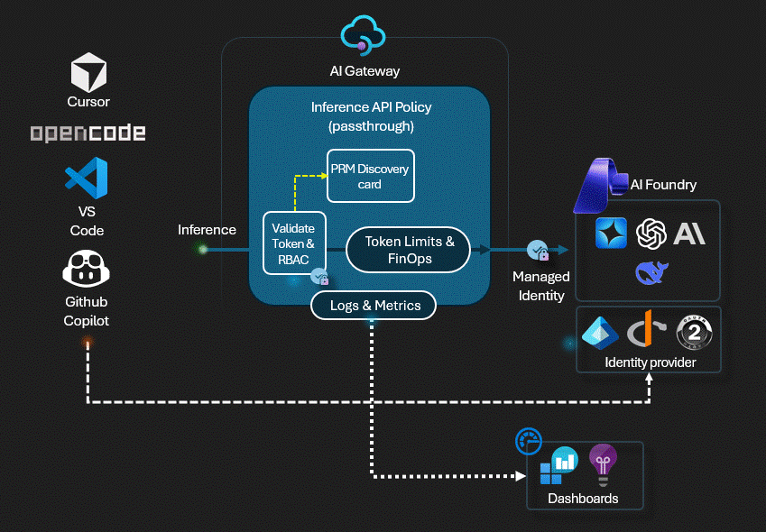
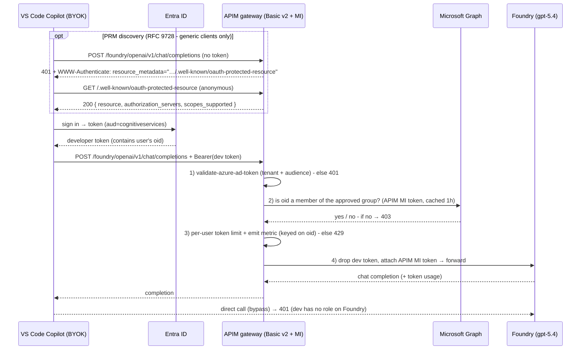
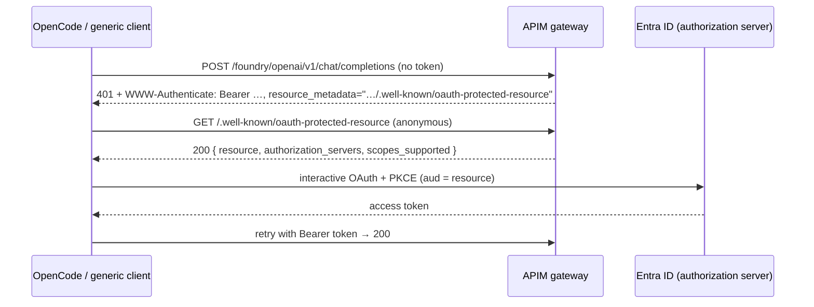

# APIM ❤️ AI Foundry

## [GitHub Copilot BYOK → Foundry lab (Option A - managed-identity swap)](ghcp-byok-foundry.ipynb)

Let developers use **your own Azure AI Foundry model inside GitHub Copilot** (keyless, Entra-only), with a central **Azure API Management** gateway enforcing four things that don't come together out of the box:

1. **Dual Authentication mode** - Entra-only auth, no API keys or ApiKey.
2. **Per-user authorization** - only members of an approved security group may use the model.
3. **Central governance** - per-developer token limits + usage metering for cost/audit.
4. **No bypass** - the model can only be reached through the gateway.

This lab builds on the great work by [@angangwa](https://github.com/angangwa) **Option A** from [copilot-byok-foundry-apim](https://github.com/angangwa/copilot-byok-foundry-apim). At the gateway, APIM authenticates the developer, asks **Microsoft Graph** whether they belong to the approved `*-users` group, applies a per-developer token limit and usage metric, then **discards the developer's token and substitutes its own managed-identity token** to call Foundry. Because the developer has no RBAC role on Foundry, a direct call bypassing the gateway is rejected (`401`) - **identity**, not the network, makes the gateway non-bypassable. No private networking is required, so the cheaper **Basic v2** APIM tier suffices.

### How it works

### 🔑 Choosing the auth mode (`authType`)

The `auth_type` parameter in the notebook's initialization cell selects how callers authenticate - the rest of the lab (managed-identity swap, metering, FinOps reports and workbook) is identical either way:

- **`EntraID`** (default) - the keyless GitHub Copilot BYOK experience described above: developer Entra token → Graph group check → per-user token limit → MI swap, plus RFC 9728 discovery for clients like OpenCode. Deploys [entra-policy.xml](entra-policy.xml).
- **`ApiKey`** - callers present an **APIM subscription key** instead of an Entra token (a shared/service-key experience). No group check, no discovery, and the API keeps `subscriptionRequired = true`. Deploys [apikey-policy.xml](apikey-policy.xml).

Both policies emit the **same** `copilot` token metrics and `copilot-finops` trace (dimensioned by `oid`, `developerName`, `model`) - in `ApiKey` mode the subscription **id** and **name** map onto `oid`/`developerName` - so the shared FinOps reports and Azure Monitor workbook work unchanged for either mode. In `ApiKey` mode the notebook automatically skips the Entra-only steps (group creation, Graph grant, keyless toggle, token acquisition, discovery and bypass tests).

### 📊 FinOps reports

Because the gateway meters every call by the developer's `oid`, `developerName` and `model` - and emits a `copilot-finops` trace that ties the router's *served* model back to the developer - Copilot → Foundry spend can be attributed to the **individual developer**. The lab surfaces this two ways, both driven by **real gateway traffic (no seeding)**:

- **In-notebook reports** - a per-developer chargeback report (token breakdown × estimated cost, with an editable price table) and a live-routing report (served model vs requested deployment, per developer) run inline via KQL.
- **Azure Monitor workbook** - a parameterized *Copilot FinOps - per-developer usage & cost* workbook (deployed by [main.bicep](main.bicep) from [workbook.json](workbook.json)) with executive summary, usage concentration (Pareto/leaderboard), model mix, live routing, chargeback and rate-limit governance. Adjust the **time range**, **price table** (USD per 1M tokens; cached input discounted) and **budget** at the top and everything recomputes live.

Cost is a token × price *estimate* that discounts cached input tokens (the gateway already emits a `Prompt Cached Tokens` metric - no policy change needed). Prices default to editable list-price placeholders; change them to your negotiated rates. Attribution needs no request/response body capture, so there's no PII in the logs.

### 🔎 OAuth discovery (RFC 9728) for OpenCode & other clients

GitHub Copilot BYOK is pre-configured with the resource and tenant, but generic clients such as **[OpenCode](https://github.com/anomalyco/opencode)** don't know them ahead of time. The gateway advertises them through **Protected Resource Metadata** discovery so any standards-compliant client can bootstrap the OAuth flow:

The 401 hint is added in [entra-policy.xml](entra-policy.xml)'s `on-error`; the anonymous metadata endpoint is an APIM API served at `/.well-known/oauth-protected-resource` from [prm-policy.xml](prm-policy.xml) (both wired by [main.bicep](main.bicep)).

> **OpenCode gotchas** - the metadata document is authored to satisfy OpenCode's strict binding rules:
> - **Strict trailing-slash match:** `resource` is `https://cognitiveservices.azure.com` (no trailing slash), matching the audience the gateway validates and the token the client must request.
> - **Root-path discovery:** the OpenID configuration for the advertised `authorization_servers` value resolves at `<authorization_server>/.well-known/openid-configuration`.

### Prerequisites

- [Python 3.12 or later version](https://www.python.org/) installed
- [VS Code](https://code.visualstudio.com/) installed with the [Jupyter notebook extension](https://marketplace.visualstudio.com/items?itemName=ms-toolsai.jupyter) enabled
- [uv](https://docs.astral.sh/uv/) - run `uv sync` from the repo root to install dependencies
- [An Azure Subscription](https://azure.microsoft.com/free/) with [Contributor](https://learn.microsoft.com/en-us/azure/role-based-access-control/built-in-roles/privileged#contributor) + [RBAC Administrator](https://learn.microsoft.com/en-us/azure/role-based-access-control/built-in-roles/privileged#role-based-access-control-administrator) or [Owner](https://learn.microsoft.com/en-us/azure/role-based-access-control/built-in-roles/privileged#owner) roles
- **Microsoft Entra privileges** to create a security group and to grant an application permission (`GroupMember.Read.All`) with admin consent (e.g. *Privileged Role Administrator* / *Global Administrator*)
- [Azure CLI](https://learn.microsoft.com/cli/azure/install-azure-cli) installed and [Signed into your Azure subscription](https://learn.microsoft.com/cli/azure/authenticate-azure-cli-interactively)

### 🚀 Get started

Proceed by opening the [Jupyter notebook](ghcp-byok-foundry.ipynb), and follow the steps provided.

### 🗑️ Clean up resources

When you're finished with the lab, you should remove all your deployed resources from Azure to avoid extra charges and keep your Azure subscription uncluttered.
Use the [clean-up-resources notebook](clean-up-resources.ipynb) for that.
