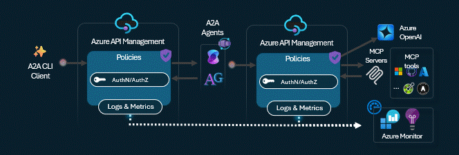

# APIM ❤️ AI Agents

## MCP-enabled A2A agents lab (initial release)

Playground to experiment with [A2A-enabled](https://www.microsoft.com/en-us/microsoft-cloud/blog/2025/05/07/empowering-multi-agent-apps-with-the-open-agent2agent-a2a-protocol/?msockid=3fc737ab34566ad7248a2255359d6b2c) agents with [Model Context Protocol](https://modelcontextprotocol.io/) with Azure API Management to enable plug & play of tools to LLMs. Leverages the [credential manager](https://learn.microsoft.com/en-us/azure/api-management/credentials-overview) for  managing OAuth 2.0 tokens to backend tools and [client token validation](https://learn.microsoft.com/en-us/azure/api-management/validate-jwt-policy) to ensure end-to-end authentication and authorization.   
This lab includes the following MCP servers:
- Basic oncall service: provides a tool to get a list of random people currently on-call with their status and time zone.
- Basic weather service: provide tools to get cities for a given country and retrieve random weather information for a specified city.
- GitHub Issues MCP Server: provide tools to authenticate on GitHub using the APIM Credential Manager, retrieves user information, and lists issues for a specified repository. This [sequence diagram](./diagrams/diagrams.md) explains the flow.

MCP-enabled agents are then deployed within ACA (Azure Container Apps) as A2A agents, one built with Semantic Kernel, and another with Autogen.

This lab demonstrates the art of the possible of creating hetrogenous multi-agentic system with agents created using multiple orchestrators, and then allowing a single unifying protocol to communicate accross the through APIM for Authn/Authz

### Prerequisites

- [Python 3.13 or later](https://www.python.org/) installed
- [VS Code](https://code.visualstudio.com/) installed with the [Jupyter notebook extension](https://marketplace.visualstudio.com/items?itemName=ms-toolsai.jupyter) enabled
- [Python environment](https://code.visualstudio.com/docs/python/environments#_creating-environments) with the [requirements.txt](../../requirements.txt) or run `pip install -r requirements.txt` in your terminal
- [An Azure Subscription](https://azure.microsoft.com/free/) with [Contributor](https://learn.microsoft.com/en-us/azure/role-based-access-control/built-in-roles/privileged#contributor) + [RBAC Administrator](https://learn.microsoft.com/en-us/azure/role-based-access-control/built-in-roles/privileged#role-based-access-control-administrator) or [Owner](https://learn.microsoft.com/en-us/azure/role-based-access-control/built-in-roles/privileged#owner) roles
- [Azure CLI](https://learn.microsoft.com/cli/azure/install-azure-cli) installed and [Signed into your Azure subscription](https://learn.microsoft.com/cli/azure/authenticate-azure-cli-interactively)

### 🚀 Get started

Proceed by opening the [Jupyter notebook](mcp-a2a-agents.ipynb), and follow the steps provided.

### 🗑️ Clean up resources

When you're finished with the lab, you should remove all your deployed resources from Azure to avoid extra charges and keep your Azure subscription uncluttered.
Use the [clean-up-resources notebook](clean-up-resources.ipynb) for that.
