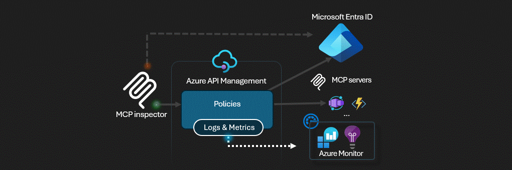

# APIM ❤️ MCP

## [MCP Client Authorization lab](mcp-client-authorization.ipynb)

Playground to experiment the [Model Context Protocol](https://modelcontextprotocol.io/) with the [client authorization flow](https://modelcontextprotocol.io/specification/2025-03-26/basic/authorization#2-10-third-party-authorization-flow). In this flow, Azure API Management act both as an OAuth client connecting to the [Microsoft Entra ID](https://learn.microsoft.com/en-us/entra/architecture/auth-oauth2) authorization server and as an OAuth authorization server for the MCP client ([MCP inspector](https://modelcontextprotocol.io/docs/tools/inspector) in this lab).

⚠️ Due to the evolving nature of the [MCP Authorization proposal](https://modelcontextprotocol.io/specification/2025-03-26/basic/authorization), direct use of this implementation in production environments is not yet recommended.

### Prerequisites

- [Python 3.12 or later version](https://www.python.org/) installed
- [VS Code](https://code.visualstudio.com/) installed with the [Jupyter notebook extension](https://marketplace.visualstudio.com/items?itemName=ms-toolsai.jupyter) enabled
- [uv](https://docs.astral.sh/uv/) — run `uv sync` from the repo root to install dependencies
- [An Azure Subscription](https://azure.microsoft.com/free/) with [Contributor](https://learn.microsoft.com/en-us/azure/role-based-access-control/built-in-roles/privileged#contributor) + [RBAC Administrator](https://learn.microsoft.com/en-us/azure/role-based-access-control/built-in-roles/privileged#role-based-access-control-administrator) or [Owner](https://learn.microsoft.com/en-us/azure/role-based-access-control/built-in-roles/privileged#owner) roles
- [Azure CLI](https://learn.microsoft.com/cli/azure/install-azure-cli) installed and [Signed into your Azure subscription](https://learn.microsoft.com/cli/azure/authenticate-azure-cli-interactively)

### 🚀 Get started

Proceed by opening the [Jupyter notebook](mcp-client-authorization.ipynb), and follow the steps provided.

### 🗑️ Clean up resources

When you're finished with the lab, you should remove all your deployed resources from Azure to avoid extra charges and keep your Azure subscription uncluttered.
Use the [clean-up-resources notebook](clean-up-resources.ipynb) for that.
