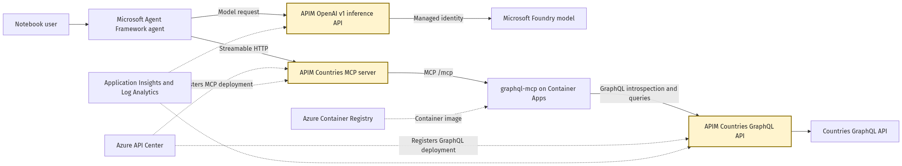

# MCP from GraphQL

## [MCP from GraphQL lab](mcp-from-graphql.ipynb)

This lab demonstrates how to turn an existing GraphQL schema into governed tools for AI agents:

- Import the public [Countries GraphQL API](https://countries.trevorblades.com/) as a native pass-through GraphQL API in Azure API Management.
- Run [graphql-mcp](https://graphql-mcp.com/) on Azure Container Apps to introspect the APIM endpoint and generate read-only MCP tools.
- Expose the translator through API Management as a Streamable HTTP MCP server.
- Register an API Center integration that dynamically discovers the GraphQL and MCP APIs from API Management.
- Test the generated tools directly and with a Microsoft Agent Framework agent.
- Route the agent's model traffic through an APIM OpenAI v1-compatible inference endpoint.

## Architecture

The agent connects only to API Management. APIM governs both model calls and MCP traffic. The translator converts MCP tool calls into GraphQL queries and sends them through the APIM GraphQL endpoint.

The GraphQL endpoint does not require an APIM subscription key because the translator must introspect it during startup. The MCP and inference endpoints require the lab's APIM subscription key.

## Implementation notes

- The translator uses Python 3.12 and pins `graphql-mcp==2.1.5`.
- `graphql-core<3.3` is pinned because the current `graphql-http` dependency imports an API removed from the 3.3 line.
- Mutations are disabled with `allow_mutations=False`.
- The MCP backend uses stateless Streamable HTTP and exposes `/mcp`.
- The APIM passthrough MCP resource uses the `2025-09-01-preview` management API required by the current programmatic MCP contract.
- API Center uses a system-assigned managed identity with API Management Service Reader Role at the APIM service scope.
- The API Center APIM source continuously synchronizes API metadata and specifications into the production environment.
- MCP diagnostics record no request or response bodies because response buffering can interfere with streaming.
- The Countries API is a third-party public demonstration dependency and requires schema introspection to remain enabled.

## Prerequisites

- [Python 3.12](https://www.python.org/) installed
- [VS Code](https://code.visualstudio.com/) with the [Jupyter extension](https://marketplace.visualstudio.com/items?itemName=ms-toolsai.jupyter)
- [uv](https://docs.astral.sh/uv/)
- [Azure CLI](https://learn.microsoft.com/cli/azure/install-azure-cli) installed and signed in
- An Azure subscription with Contributor plus RBAC Administrator, or Owner permissions

Docker is not required locally. The notebook builds the translator image remotely with Azure Container Registry.

## Get started

Open [mcp-from-graphql.ipynb](mcp-from-graphql.ipynb) and run the cells sequentially.

## Clean up

Run [clean-up-resources.ipynb](clean-up-resources.ipynb) when finished to remove the deployed resources and stop charges.