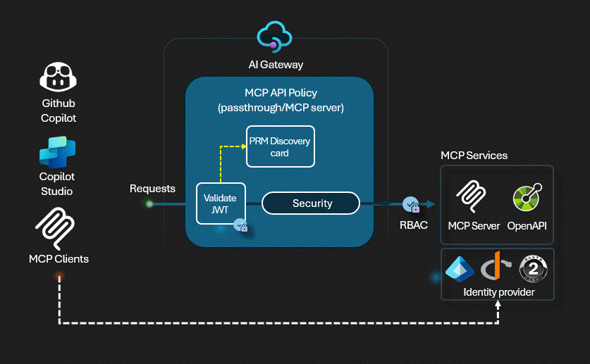

# APIM ❤️ MCP

## MCP Protected Resources Metadata - PRM

Playground to experiment the [Model Context Protocol](https://modelcontextprotocol.io/) with the [client authorization flow](https://modelcontextprotocol.io/specification/2025-03-26/basic/authorization#2-10-third-party-authorization-flow). 

In this flow, Azure API Management act both as an OAuth client connecting to the [Microsoft Entra ID](https://learn.microsoft.com/en-us/entra/architecture/auth-oauth2) authorization server and as an OAuth authorization server for the MCP client ([MCP inspector](https://modelcontextprotocol.io/docs/tools/inspector) in this lab), VS Code or Copilot Studio.

Full documentation of the assets created in this lab and how they interact is documented in [Arch decisions summary](ARCH_SUMMARY.md) and in [MCP PRM Server implementation](src/mcp-prm-server/README.md)

⚠️ This lab implements the [MCP Authorization proposal](https://modelcontextprotocol.io/specification/2025-03-26/basic/authorization) and [RFC9729](https://datatracker.ietf.org/doc/html/rfc9728), this is as close to production-grade security for MCP servers as it gets, and is inspired by the amazing work by [blackchoey/remote-mcp-apim-oauth-prm](https://github.com/blackchoey/remote-mcp-apim-oauth-prm) - originally written in C#

### Prerequisites

- Entra ID permissions to create and manage App Registrations
- [Python 3.12 or later version](https://www.python.org/) installed
- [VS Code](https://code.visualstudio.com/) installed with the [Jupyter notebook extension](https://marketplace.visualstudio.com/items?itemName=ms-toolsai.jupyter) enabled
- [Python environment](https://code.visualstudio.com/docs/python/environments#_creating-environments) with the [requirements.txt](../../requirements.txt) or run `pip install -r requirements.txt` in your terminal
- [An Azure Subscription](https://azure.microsoft.com/free/) with [Contributor](https://learn.microsoft.com/en-us/azure/role-based-access-control/built-in-roles/privileged#contributor) + [RBAC Administrator](https://learn.microsoft.com/en-us/azure/role-based-access-control/built-in-roles/privileged#role-based-access-control-administrator) or [Owner](https://learn.microsoft.com/en-us/azure/role-based-access-control/built-in-roles/privileged#owner) roles
- [Azure CLI](https://learn.microsoft.com/cli/azure/install-azure-cli) installed and [Signed into your Azure subscription](https://learn.microsoft.com/cli/azure/authenticate-azure-cli-interactively)

### 🚀 Get started

Proceed by opening the [Jupyter notebook](mcp-client-authorization.ipynb), and follow the steps provided.

### 🗑️ Clean up resources

When you're finished with the lab, you should remove all your deployed resources from Azure to avoid extra charges and keep your Azure subscription uncluttered.
Use the [clean-up-resources notebook](clean-up-resources.ipynb) for that.
