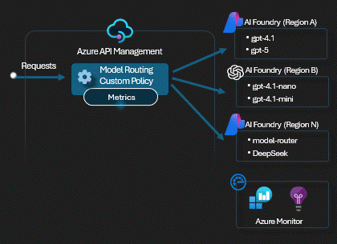

# APIM ❤️ OpenAI

## [Model Routing lab](model-routing.ipynb)

Playground to try routing to a backend based on Azure OpenAI model and version.

### Prerequisites

- [Python 3.8 or later version](https://www.python.org/) installed
- [Pandas Library](https://pandas.pydata.org) installed
- [VS Code](https://code.visualstudio.com/) installed with the [Jupyter notebook extension](https://marketplace.visualstudio.com/items?itemName=ms-toolsai.jupyter) enabled
- [Azure CLI](https://learn.microsoft.com/cli/azure/install-azure-cli) installed
- [An Azure Subscription](https://azure.microsoft.com/free/) with Contributor permissions
- [Access granted to Azure OpenAI](https://aka.ms/oai/access) or just enable the mock service
- [Sign in to Azure with Azure CLI](https://learn.microsoft.com/cli/azure/authenticate-azure-cli-interactively)

### 🚀 Get started

Proceed by opening the [Jupyter notebook](model-routing.ipynb), and follow the steps provided.

### 🗑️ Clean up resources

When you're finished with the lab, you should remove all your deployed resources from Azure to avoid extra charges and keep your Azure subscription uncluttered.
Use the [clean-up-resources notebook](clean-up-resources.ipynb) for that.

### Caveats

- The lab currently does not use the same Azure OpenAI instance for multiple models. This would be preferential, especially with PTU use, but the bicep got a bit too convoluted for that.
- The determination as to what endpoint to use is driven through a particular deployment naming convention. This approach can be changed. Perhaps using the model as a suffix is more appropriate
    for you. Maybe not using anything model-related at all and just performing explicit translations in API Management works better for your use cases. It's not as important to demonstrate how
    you can change this as it is to show that you can use the same API Management endpoint for many models.
