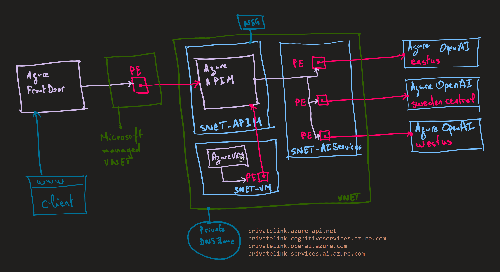

# APIM ❤️ OpenAI

## [Private Connectivity Lab](private-connectivity.ipynb)

Playground to try the private connectivity [private connectivity functionality of APIM](https://learn.microsoft.com/en-us/azure/api-management/private-endpoint?tabs=v2) to a list of Azure OpenAI private endpoints.

### Prerequisites

- [Python 3.12 or later version](https://www.python.org/) installed
- [VS Code](https://code.visualstudio.com/) installed with the [Jupyter notebook extension](https://marketplace.visualstudio.com/items?itemName=ms-toolsai.jupyter) enabled
- [Azure CLI](https://learn.microsoft.com/cli/azure/install-azure-cli) installed
- [An Azure Subscription](https://azure.microsoft.com/free/) with Contributor permissions
- [Sign in to Azure with Azure CLI](https://learn.microsoft.com/cli/azure/authenticate-azure-cli-interactively)

### 🚀 Get started

Proceed by opening the [Jupyter notebook](private-connectivity.ipynb), and follow the steps provided.

### 📺 Video tutorial

If you prefer a video tutorial, you can watch the [YouTube video explaining the architecture](https://www.youtube.com/watch?v=sUchn_XjpaI) or this [YouTube video lab](https://www.youtube.com/watch?v=BN1aobzBapg) that walks you through the lab.

### 🗑️ Clean up resources

When you're finished with the lab, you should remove all your deployed resources from Azure to avoid extra charges and keep your Azure subscription uncluttered.
Use the [clean-up-resources notebook](clean-up-resources.ipynb) for that.
