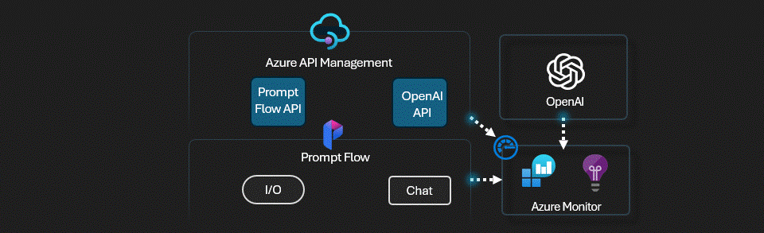
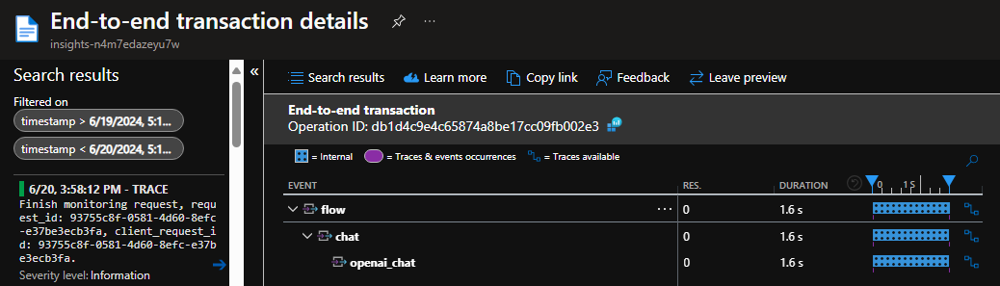

# APIM ❤️ OpenAI

## Prompt flow lab

Playground to try the [Azure AI Studio Prompt Flow](https://learn.microsoft.com/en-us/azure/ai-studio/how-to/prompt-flow) with Azure API Management. The Prompt Flow OpenAI connection will be facilitated by APIM, enabling load balancing, token counting, and other features. The Prompt Flow will run in an Azure Container App and will be accessed through APIM.

Prompt flow is a development tool designed to streamline the entire development cycle of AI applications powered by Large Language Models (LLMs). Prompt flow provides a comprehensive solution that simplifies the process of prototyping, experimenting, iterating, and deploying your AI applications.
Prompt flow is available independently as an open-source project on [GitHub](https://github.com/microsoft/promptflow).

### Result

### Prerequisites

- [Python 3.8 or later version](https://www.python.org/) installed
- [Prompt flow](https://microsoft.github.io/promptflow/how-to-guides/installation/index.html#install-prompt-flow) installed
- [VS Code](https://code.visualstudio.com/) installed with the [Jupyter notebook extension](https://marketplace.visualstudio.com/items?itemName=ms-toolsai.jupyter) enabled
- [Azure CLI](https://learn.microsoft.com/en-us/cli/azure/install-azure-cli) installed
- [An Azure Subscription](https://azure.microsoft.com/en-us/free/) with Contributor permissions
- [Access granted to Azure OpenAI](https://aka.ms/oai/access) or just enable the mock service
- [Sign in to Azure with Azure CLI](https://learn.microsoft.com/en-us/cli/azure/authenticate-azure-cli-interactively)

### 🚀 Get started

Proceed by opening the [Jupyter notebook](prompt-flow.ipynb), and follow the steps provided.

### 🗑️ Clean up resources

When you're finished with the lab, you should remove all your deployed resources from Azure to avoid extra charges and keep your Azure subscription uncluttered.
Use the [clean-up-resources notebook](clean-up-resources.ipynb) for that.
