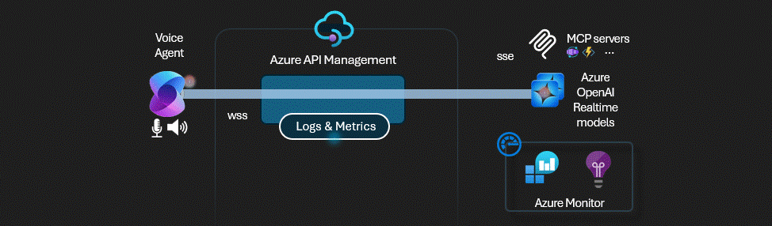
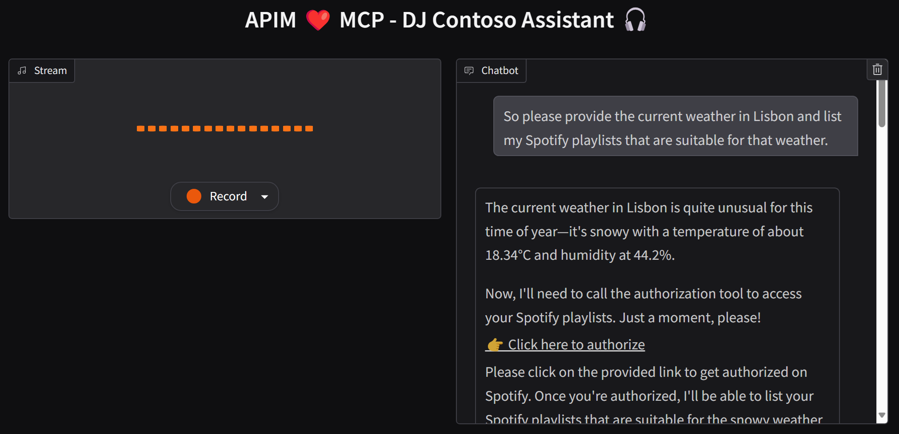

# APIM ❤️ AI Agents

## [Realtime Audio with MCP tools and Agents lab lab](realtime-mcp-agents.ipynb)

Playground to experiment the with [Azure OpenAI Realtime API](https://learn.microsoft.com/en-us/azure/ai-services/openai/realtime-audio-reference) for text and audio with integrations via [Model Context Protocol](https://modelcontextprotocol.io/) with Azure API Management to enable plug & play of tools to LLMs. Leverages the [credential manager](https://learn.microsoft.com/en-us/azure/api-management/credentials-overview) for  managing OAuth 2.0 tokens to backend tools and [client token validation](https://learn.microsoft.com/en-us/azure/api-management/validate-jwt-policy) to ensure end-to-end authentication and authorization.   
This lab includes the following MCP servers:
- Basic weather service: provide tools to get cities for a given country and retrieve random weather information for a specified city.
- Spotify service: provide tools to authenticate on Spotify using the APIM Credential Manager, retrieves Playlists, Latest releases, start/stop music playing, and more. 
- ServiceNow incidents MCP Server: provides tools to authenticates on ServiceNow using the APIM Credential Manager, lists incidents, retrieves a particular incident and create a new one.

### Result

### Prerequisites

- [Python 3.12 or later version](https://www.python.org/) installed
- [VS Code](https://code.visualstudio.com/) installed with the [Jupyter notebook extension](https://marketplace.visualstudio.com/items?itemName=ms-toolsai.jupyter) enabled
- [Python environment](https://code.visualstudio.com/docs/python/environments#_creating-environments) with the [requirements.txt](../../requirements.txt) or run `pip install -r requirements.txt` in your terminal
- [An Azure Subscription](https://azure.microsoft.com/free/) with [Contributor](https://learn.microsoft.com/en-us/azure/role-based-access-control/built-in-roles/privileged#contributor) + [RBAC Administrator](https://learn.microsoft.com/en-us/azure/role-based-access-control/built-in-roles/privileged#role-based-access-control-administrator) or [Owner](https://learn.microsoft.com/en-us/azure/role-based-access-control/built-in-roles/privileged#owner) roles
- [Azure CLI](https://learn.microsoft.com/cli/azure/install-azure-cli) installed and [Signed into your Azure subscription](https://learn.microsoft.com/cli/azure/authenticate-azure-cli-interactively)

### 🚀 Get started

Proceed by opening the [Jupyter notebook](realtime-mcp-agents.ipynb), and follow the steps provided.

### 🗑️ Clean up resources

When you're finished with the lab, you should remove all your deployed resources from Azure to avoid extra charges and keep your Azure subscription uncluttered.
Use the [clean-up-resources notebook](clean-up-resources.ipynb) for that.
