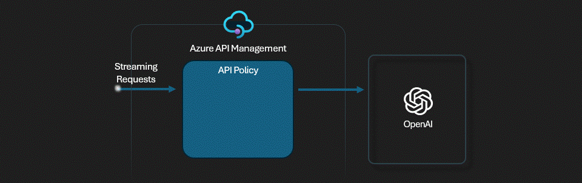

# APIM ❤️ OpenAI

## [Response streaming lab](response-streaming.ipynb)

Playground to try response streaming with APIM and Azure OpenAI endpoints to explore the advantages and shortcomings associated with streaming. To get responses sooner, you can 'stream' the completion as it's being generated. This allows you to start printing or processing the beginning of the completion before the full completion is finished.

Follow the [APIM guidelines for SSE](https://learn.microsoft.com/azure/api-management/how-to-server-sent-events#guidelines-for-sse) to guarantee that your APIM configuration is compatible with streaming.

This lab reuses the [Cookbook - How to stream completions](https://cookbook.openai.com/examples/how_to_stream_completions) published by OpenAI.

### Notes

- To stream completions, set stream=True when calling the chat completions or completions endpoints. This will return an object that streams back the response as data-only server-sent events. Extract chunks from the delta field rather than the message field.
- Streaming responses doesn't includes the usage field to tell how many tokens were consumed.
- Streaming in a production application makes it more difficult to moderate the content of the completions, as partial completions may be more difficult to evaluate.

### Prerequisites

- [Python 3.9 or later version](https://www.python.org/) installed
- [VS Code](https://code.visualstudio.com/) installed with the [Jupyter notebook extension](https://marketplace.visualstudio.com/items?itemName=ms-toolsai.jupyter) enabled
- [Azure CLI](https://learn.microsoft.com/cli/azure/install-azure-cli) installed
- [An Azure Subscription](https://azure.microsoft.com/free/) with Contributor permissions
- [Access granted to Azure OpenAI](https://aka.ms/oai/access) or just enable the mock service
- [Sign in to Azure with Azure CLI](https://learn.microsoft.com/cli/azure/authenticate-azure-cli-interactively)

### 🚀 Get started

Proceed by opening the [Jupyter notebook](response-streaming.ipynb), and follow the steps provided.

### 🗑️ Clean up resources

When you're finished with the lab, you should remove all your deployed resources from Azure to avoid extra charges and keep your Azure subscription uncluttered.
Use the [clean-up-resources notebook](clean-up-resources.ipynb) for that.
