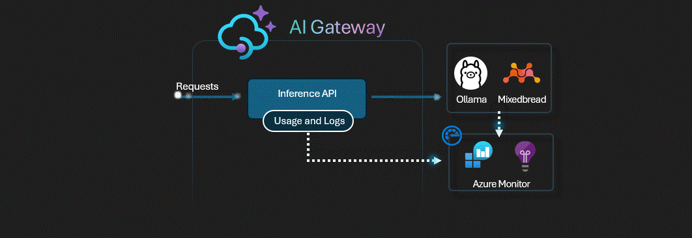

# APIM ❤️ Self-Hosted Ollama

## [Self-Hosted Ollama behind APIM lab](self-hosted-ollama.ipynb)

This lab deploys a **CPU-only Ollama** container on **Azure Container Instances** with the `mxbai-embed-large` embedding model, fronted by **Azure API Management**.

The Ollama endpoint is exposed exclusively through APIM so that every call requires a subscription key. Based on the [Ollama_in_Azure](https://github.com/sorgina13/Ollama_in_Azure) repository.

### Architecture

1. **Azure Container Registry (ACR)** — stores the Ollama container image
2. **User-assigned Managed Identity** — used by ACI for authenticated ACR pulls
3. **Azure Container Instances (ACI)** — runs the Ollama server with `mxbai-embed-large`
4. **Azure API Management (APIM)** — fronts the ACI endpoint, requiring a subscription key for every request

### Prerequisites

- [Python 3.12 or later version](https://www.python.org/) installed
- [VS Code](https://code.visualstudio.com/) installed with the [Jupyter notebook extension](https://marketplace.visualstudio.com/items?itemName=ms-toolsai.jupyter) enabled
- [Python environment](https://code.visualstudio.com/docs/python/environments#_creating-environments) with the [requirements.txt](../../../requirements.txt) or run `pip install -r requirements.txt` in your terminal
- [An Azure Subscription](https://azure.microsoft.com/free/) with [Contributor](https://learn.microsoft.com/en-us/azure/role-based-access-control/built-in-roles/privileged#contributor) + [RBAC Administrator](https://learn.microsoft.com/en-us/azure/role-based-access-control/built-in-roles/privileged#role-based-access-control-administrator) or [Owner](https://learn.microsoft.com/en-us/azure/role-based-access-control/built-in-roles/privileged#owner) roles
- [Azure CLI](https://learn.microsoft.com/cli/azure/install-azure-cli) installed and [Signed into your Azure subscription](https://learn.microsoft.com/cli/azure/authenticate-azure-cli-interactively)

### 🚀 Get started

Proceed by opening the [Jupyter notebook](self-hosted-ollama.ipynb), and follow the steps provided.

### 🗑️ Clean up resources

When you're finished with the lab, you should remove all your deployed resources from Azure to avoid extra charges and keep your Azure subscription uncluttered.
Use the [clean-up-resources notebook](clean-up-resources.ipynb) for that.
