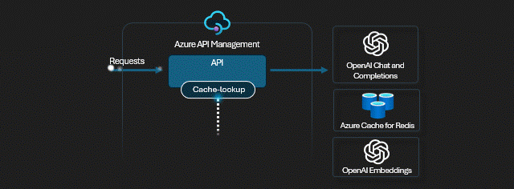
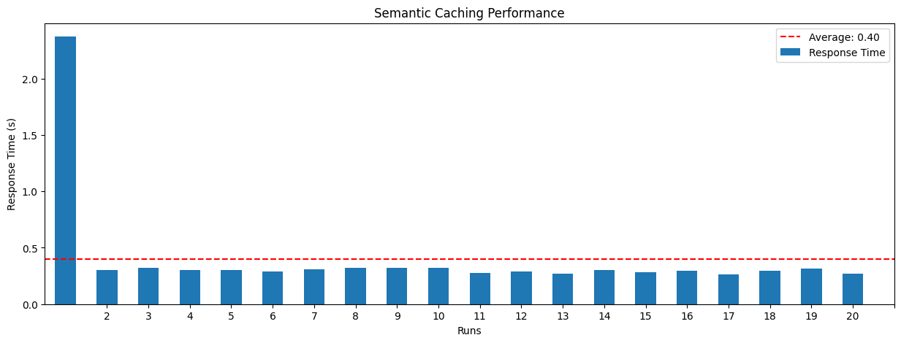

# APIM ❤️ OpenAI

## [Semantic Caching lab](semantic-caching.ipynb)

Playground to try the [sementic caching policy](https://learn.microsoft.com/azure/api-management/azure-openai-semantic-cache-lookup-policy).

The azure-openai-semantic-cache-lookup policy conducts a cache lookup of responses on Azure OpenAI Chat Completion API and Completion API requests from a pre-configured external cache. It operates by comparing the vector proximity of the prompt to prior requests and using a specific similarity score threshold. Caching responses helps reduce bandwidth and processing demands on the backend Azure OpenAI API, thus reducing latency perceived by API consumers.

### Result

### Prerequisites

- [Python 3.9 or later version](https://www.python.org/) installed
- [Pandas Library](https://pandas.pydata.org) installed
- [VS Code](https://code.visualstudio.com/) installed with the [Jupyter notebook extension](https://marketplace.visualstudio.com/items?itemName=ms-toolsai.jupyter) enabled
- [Azure CLI](https://learn.microsoft.com/cli/azure/install-azure-cli) installed
- [An Azure Subscription](https://azure.microsoft.com/free/) with Contributor permissions
- [Access granted to Azure OpenAI](https://aka.ms/oai/access) or just enable the mock service
- [Sign in to Azure with Azure CLI](https://learn.microsoft.com/cli/azure/authenticate-azure-cli-interactively)

### 🚀 Get started

Proceed by opening the [Jupyter notebook](semantic-caching.ipynb), and follow the steps provided.

### 🗑️ Clean up resources

When you're finished with the lab, you should remove all your deployed resources from Azure to avoid extra charges and keep your Azure subscription uncluttered.
Use the [clean-up-resources notebook](clean-up-resources.ipynb) for that.
