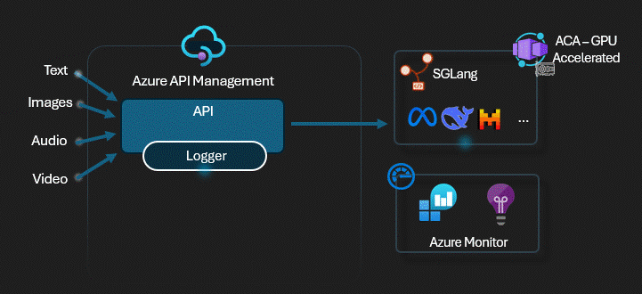

# APIM ❤️ AI Gateway

## [Serverless GPU Inference lab](serverless-gpu.ipynb)

Deploy [SGLang](https://docs.sglang.ai/) on [Azure Container Apps](https://learn.microsoft.com/azure/container-apps/overview) with GPU acceleration (NVIDIA A100) and expose it through [Azure API Management](https://learn.microsoft.com/azure/api-management/api-management-key-concepts) as an OpenAI-compatible endpoint.

### What this lab demonstrates

- Deploying a **GPU-accelerated Container App** with `Consumption-GPU-NC24-A100` workload profiles
- Running **SGLang** as a high-performance LLM inference server using its official Docker image
- Exposing the SGLang **OpenAI-compatible API** through APIM with subscription key authentication
- Using the standard **OpenAI Python SDK** to interact with self-hosted models through the APIM gateway
- **Streaming** support for real-time token generation

### Prerequisites

- [Python 3.12 or later version](https://www.python.org/) installed
- [VS Code](https://code.visualstudio.com/) installed with the [Jupyter notebook extension](https://marketplace.visualstudio.com/items?itemName=ms-toolsai.jupyter) enabled
- [Python environment](https://code.visualstudio.com/docs/python/environments#_creating-environments) with the [requirements.txt](../../requirements.txt) or run `pip install -r requirements.txt` in your terminal
- [An Azure Subscription](https://azure.microsoft.com/free/) with [Contributor](https://learn.microsoft.com/en-us/azure/role-based-access-control/built-in-roles/privileged#contributor) + [RBAC Administrator](https://learn.microsoft.com/en-us/azure/role-based-access-control/built-in-roles/privileged#role-based-access-control-administrator) or [Owner](https://learn.microsoft.com/en-us/azure/role-based-access-control/built-in-roles/privileged#owner) roles
- [Azure CLI](https://learn.microsoft.com/cli/azure/install-azure-cli) installed and [Signed into your Azure subscription](https://learn.microsoft.com/cli/azure/authenticate-azure-cli-interactively)
- A [HuggingFace token](https://huggingface.co/settings/tokens) with access to gated models (e.g., Llama)

### ⚠️ Cost warning

GPU Container Apps use `Consumption-GPU-NC24-A100` workload profiles which are expensive (~$4/hr). **Remember to clean up resources when done.**

### 🚀 Get started

Proceed by opening the [Jupyter notebook](serverless-gpu.ipynb), and follow the steps provided.

### 🗑️ Clean up resources

When you're finished with the lab, you should remove all your deployed resources from Azure to avoid extra charges and keep your Azure subscription uncluttered.
Use the [clean-up-resources notebook](clean-up-resources.ipynb) for that.
