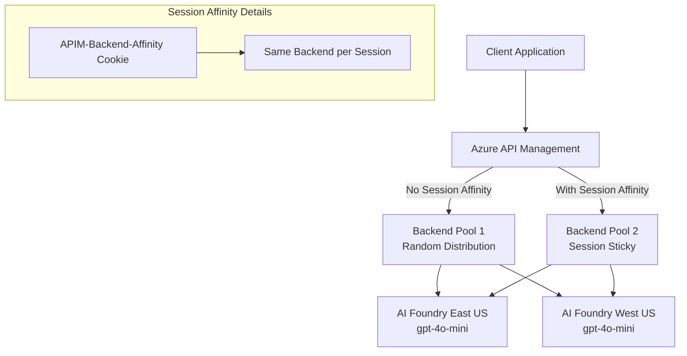

# APIM ❤️ AI Foundry

## [Session Awareness lab](session-awareness.ipynb)

Playground to demonstrate session awareness capabilities in [Azure API Management backend pools](https://learn.microsoft.com/azure/api-management/backends?tabs=bicep) when using the [OpenAI Responses API](https://learn.microsoft.com/azure/ai-foundry/openai/how-to/responses) for multi-turn conversations.

### Overview

The OpenAI Responses API requires maintaining conversation state across multiple API calls by using a response ID from previous calls. When using a backend pool without session affinity, requests can be routed to different backend instances, breaking the conversation state. This lab demonstrates:

1. **Backend Pool without Session Affinity**: Shows how conversation state breaks when requests are distributed across different backends
2. **Backend Pool with Session Affinity**: Shows how session affinity ensures requests from the same conversation stay on the same backend

### What You'll Learn

- **Backend Pool Management**: Configure APIM backend pools with multiple AI Foundry instances  
- **Session Affinity**: Enable and configure cookie-based session stickiness
- **Load Balancing**: Understand the difference between random distribution and session-aware routing
- **Stateful API Support**: Maintain conversation state across multiple API calls
- **Multi-region Deployment**: Deploy AI services across different Azure regions

### Key Features Demonstrated

- **Native APIM Session Affinity**: Uses Azure API Management's built-in session affinity features
- **Cookie-based Session Tracking**: Automatic session management via APIM-Backend-Affinity cookies
- **OpenAI Responses API**: Real-world stateful API that requires conversation continuity
- **Multi-region Backends**: Two AI Foundry instances in different Azure regions
- **Progressive Learning**: Start with broken conversations, then fix with session affinity

### Prerequisites

- [Python 3.12 or later version](https://www.python.org/) installed
- [VS Code](https://code.visualstudio.com/) installed with the [Jupyter notebook extension](https://marketplace.visualstudio.com/items?itemName=ms-toolsai.jupyter) enabled
- [Python environment](https://code.visualstudio.com/docs/python/environments#_creating-environments) with the [requirements.txt](../../requirements.txt) or run `pip install -r requirements.txt` in your terminal
- [An Azure Subscription](https://azure.microsoft.com/free/) with [Contributor](https://learn.microsoft.com/en-us/azure/role-based-access-control/built-in-roles/privileged#contributor) + [RBAC Administrator](https://learn.microsoft.com/en-us/azure/role-based-access-control/built-in-roles/privileged#role-based-access-control-administrator) or [Owner](https://learn.microsoft.com/en-us/azure/role-based-access-control/built-in-roles/privileged#owner) roles
- [Azure CLI](https://learn.microsoft.com/cli/azure/install-azure-cli) installed and [Signed into your Azure subscription](https://learn.microsoft.com/cli/azure/authenticate-azure-cli-interactively)

### 🚀 Get started

Proceed by opening the [Jupyter notebook](session-awareness.ipynb), and follow the steps provided.

### 🗑️ Clean up resources

When you're finished with the lab, you should remove all your deployed resources from Azure to avoid extra charges and keep your Azure subscription uncluttered.
Use the [clean-up-resources notebook](clean-up-resources.ipynb) for that.

### Architecture

### When to Use Session Affinity

- **OpenAI Responses API**: Multi-turn conversations requiring response IDs
- **Stateful AI Agents**: Agents maintaining conversation context
- **OpenAI Assistants API**: Thread-based conversations
- **Function Calling Scenarios**: Multi-step tool execution workflows
- **Any Stateful API**: APIs that maintain server-side session state
