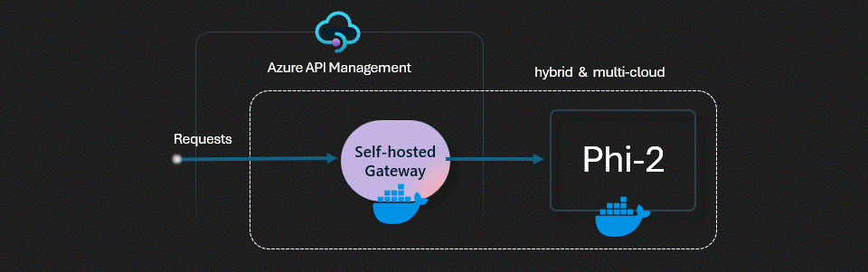

# APIM ❤️ OpenAI

## [SLM self hosting lab](slm-self-hosting.ipynb)

Playground to try the self-hosted [phy-3 Small Language Model (SLM)](https://azure.microsoft.com/blog/introducing-phi-3-redefining-whats-possible-with-slms/) through the [APIM self-hosted gateway](https://learn.microsoft.com/azure/api-management/self-hosted-gateway-overview) with OpenAI API compatibility.

The Phi-3-Mini-4K-Instruct is a 3.8B parameters, lightweight, state-of-the-art open model trained with the Phi-3 datasets that includes both synthetic data and the filtered publicly available websites data with a focus on high-quality and reasoning dense properties. The model belongs to the Phi-3 family with the Mini version in two variants 4K and 128K which is the context length (in tokens) that it can support.

The model has underwent a post-training process that incorporates both supervised fine-tuning and direct preference optimization for the instruction following and safety measures. When assessed against benchmarks testing common sense, language understanding, math, code, long context and logical reasoning, Phi-3 Mini-4K-Instruct showcased a robust and state-of-the-art performance among models with less than 13 billion parameters.

The APIM self-hosted gateway is a containerized version of the default managed gateway. It's useful for scenarios such as placing gateways in the same environments where you host your APIs. Like in this experiment where we self-host the phi-2 API. This enable use cases where the SLM is running on-premises

### Prerequisites

- [Python 3.8 or later version](https://www.python.org/) installed
- [VS Code](https://code.visualstudio.com/) installed with the [Jupyter notebook extension](https://marketplace.visualstudio.com/items?itemName=ms-toolsai.jupyter) enabled
- [Azure CLI](https://learn.microsoft.com/cli/azure/install-azure-cli) installed
- [An Azure Subscription](https://azure.microsoft.com/free/) with Contributor permissions
- [Access granted to Azure OpenAI](https://aka.ms/oai/access) or just enable the mock service
- [Sign in to Azure with Azure CLI](https://learn.microsoft.com/cli/azure/authenticate-azure-cli-interactively)

### 🚀 Get started

Proceed by opening the [Jupyter notebook](slm-self-hosting.ipynb), and follow the steps provided.

### 🗑️ Clean up resources

When you're finished with the lab, you should remove all your deployed resources from Azure to avoid extra charges and keep your Azure subscription uncluttered.
Use the [clean-up-resources notebook](clean-up-resources.ipynb) for that.
