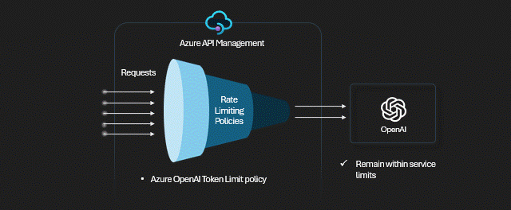

# APIM ❤️ OpenAI

## [Token Rate Limiting lab](token-rate-limiting.ipynb)

Playground to try the [token rate limiting policy](https://learn.microsoft.com/en-us/azure/api-management/azure-openai-token-limit-policy) to either a list of Azure OpenAI endpoints or mock servers.

The azure-openai-token-limit policy prevents Azure OpenAI Service API usage spikes on a per key basis by limiting consumption of language model tokens to a specified number per minute. When the token usage is exceeded, the caller receives a 429 Too Many Requests response status code.

### Prerequisites
- [Python 3.8 or later version](https://www.python.org/) installed
- [VS Code](https://code.visualstudio.com/) installed with the [Jupyter notebook extension](https://marketplace.visualstudio.com/items?itemName=ms-toolsai.jupyter) enabled
- [Azure CLI](https://learn.microsoft.com/en-us/cli/azure/install-azure-cli) installed
- [An Azure Subscription](https://azure.microsoft.com/en-us/free/) with Contributor permissions
- [Access granted to Azure OpenAI](https://aka.ms/oai/access) or just enable the mock service
- [Sign in to Azure with Azure CLI](https://learn.microsoft.com/en-us/cli/azure/authenticate-azure-cli-interactively)

### 🚀 Get started
Proceed by opening the [Jupyter notebook](token-rate-limiting.ipynb), and follow the steps provided.

### 🗑️ Clean up resources
When you're finished with the lab, you should remove all your deployed resources from Azure to avoid extra charges and keep your Azure subscription uncluttered.
Use the [clean-up-resources notebook](clean-up-resources.ipynb) for that.