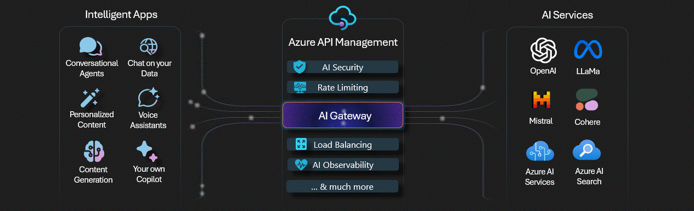

# Introduction

Businesses are building applications that rely heavily on Artificial Intelligence (AI) to deliver advanced functionalities. They may include:

- **Conversational Agents:** Applications like chatbots and virtual assistants that interact with users in natural language.
- **Chat on Your Data:** Apps that allow users to query and interact with their own data using AI.
- **Voice Assistants:** AI-powered tools that enable voice-based interactions.
- **Personalized Content:** Applications that generate tailored recommendations or content for users.
- **Content Generation:** Tools that use AI to  create content such as text, images, or videos.
- **Your Own Copilot:** Custom AI assistants designed to enhance productivity and automate tasks.

While AI-powered applications offer immense potential, they also introduce several challenges and risks that organizations must address to ensure success. These risks stem from the complexity of managing interactions with AI services, especially when APIs are left unmanaged. 

## Risks of Unmanaged APIs in AI Applications

Unmanaged APIs can pose significant risks in the era of AI.

1. **Unpredictable Costs**: Without proper monitoring and control, API usage can lead to unexpected expenses, especially when dealing with high-volume AI requests.
2. **Reliability Concerns**: Unmanaged APIs may lack redundancy and failover mechanisms, leading to inconsistent performance and downtime.
3. **Security Risks**: AI APIs that are not secured properly can be exploited leading to misuse of sensitive data.
4. **Governance Challenges**: Without a  centralized management blueprint, enforcing policies, monitoring AI Service usage, and maintaining audit logs becomes difficult.

These challenges can hinder the scalability, security, and cost-efficiency of AI applications, making it essential to adopt a robust solution for API management.

## AI Gateway in Azure API Management

This is where the AI Gateway comes into play. Acting as a centralized hub, the gateway simplifies the integration of AI services into applications. It ensures secure, efficient, and optimized communication between Intelligent Apps and AI Services while providing essential features like security, observability, and load balancing.

1. **Cost Efficiency**:
   - Control and attribute costs with token monitoring, limits, and quotas.
   - Optimize responses by caching results for semantically similar prompts.

2. **High Reliability**:
   - Enable geo-redundancy and automatic failovers.
   - Use load balancing and circuit breakers to ensure consistent performance.

3. **Robust Security**:
   - Isolate and manage user credentials securely.
   - Leverage built-in controls and Microsoft Defender for Cloud to protect APIs.

4. **Developer Enablement**:
   - Replace custom backend code with built-in policies for faster development.
   - Publish AI APIs for consumption and gain insights with comprehensive logs.

5. **Enhanced Governance**:
   - Enforce runtime policies to maintain compliance.
   - Centralize monitoring and audit logs for better visibility and control.

By leveraging Azure API Management, developers can focus on building innovative AI-powered solutions without worrying about the complexities of managing multiple AI services. The AI Gateway bridges the gap, enabling seamless and scalable interactions in a rapidly evolving AI ecosystem.

Watch the video below to learn more:

<iframe width="560" height="315" src="https://www.youtube.com/embed/-6pq-r7AUe4?si=0oagnD8CIEgdLHg8" title="YouTube video player" frameborder="0" allow="accelerometer; autoplay; clipboard-write; encrypted-media; gyroscope; picture-in-picture; web-share" referrerpolicy="strict-origin-when-cross-origin" allowfullscreen></iframe>

